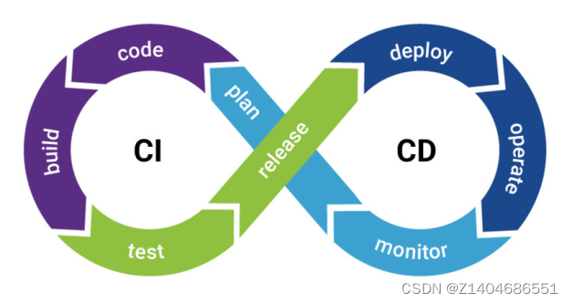

# IT行业术语

1. CI、CD 其实是三个概念，包含了一个 CI 和两个 CD，CI全称 Continuous Integration，表示持续集成，CD包含 Continuous Delivery和 Continuous Deployment，分别是持续交付和持续部署。

    

2. DevOps（Development和Operations的组合词）是一组过程、方法与系统的统称，用于促进开发（应用程序/软件工程）、技术运营和质量保障（QA）部门之间的沟通、协作与整合。  
    DevOps包含development和operations，是开发和运营维护的总称。软件设计过程中，应对开发部门、运维部门进行协调，确保各项工作流程与方法高效使用，为项目管理工作提供可靠参考。基于devops软件开发源于2009年欧洲传统IT模式，对解决运维管理问题起到关键作用。为巩固软件设计与开发结果，将开发、运维与测试结合一起，形成了DevOps软件开发管理模式。
