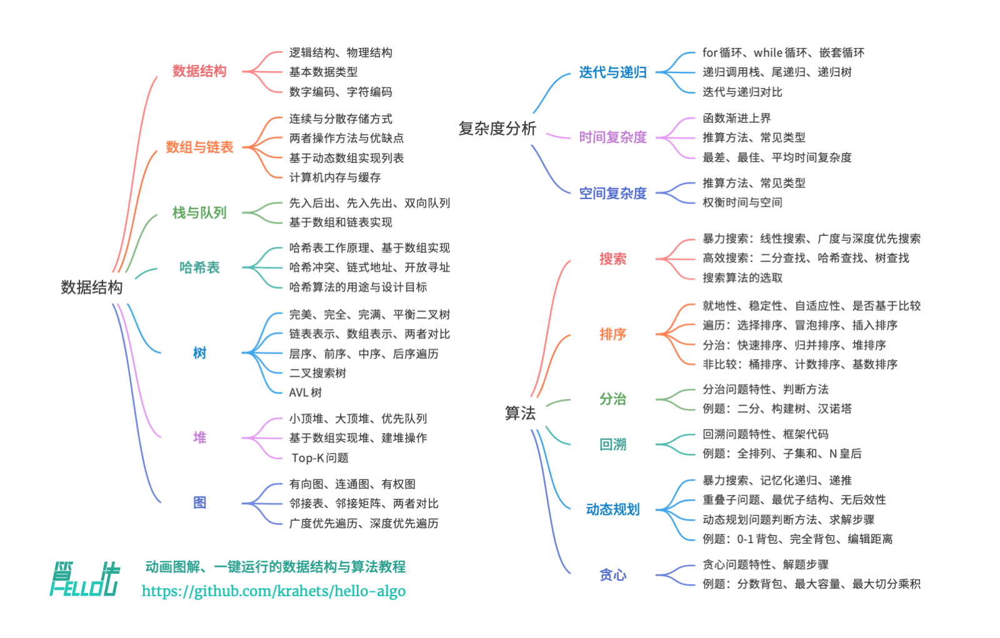
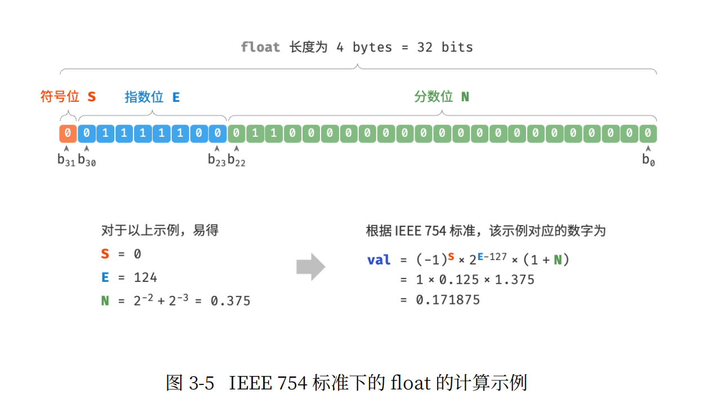
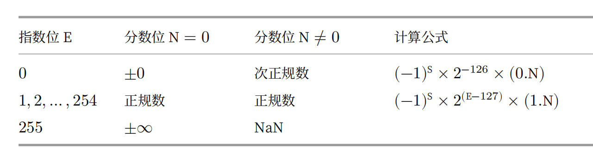

# Hello 算法 （Java 版）



1. 当涉及编程语言之间不一致的名词时，本书均以 Python 为准，例如使用 None 来表示“空”。

## 第 1 章  初识算法

1. 许多编程语言的排序库函数中都有插入排序的身影。  
     “插入排序”算法在处理小型数据集时非常高效。
2. 算法(algorithm)是在有限时间内解决特定问题的一组指令或操作步骤，它具有以下特性：  
    问题是明确的，包含清晰的输入和输出定义。  
    具有可行性，能够在有限步骤、时间和内存空间下完成。  
    各步骤都有确定的含义，在相同的输入和运行条件下，输出始终相同。
3. 数据结构(data structure)是计算机中组织和存储数据的方式，具有以下设计目标：  
    空间占用尽量少，以节省计算机内存。  
    数据操作尽可能快速，涵盖数据访问、添加、删除、更新等。  
    提供简洁的数据表示和逻辑信息，以便算法高效运行。
4. 数据结构设计是一个充满权衡的过程。如果想在某方面取得提升，往往需要在另一方面作出妥协。
5. 算法通常可以基于不同的数据结构实现，但执行效率可能相差很大，选择合适的数据结构是关键。
6. 数据结构与算法是独立于编程语言的。

## 第 2 章  复杂度分析

1. 我们的目标是设计“既快又省”的数据结构与算法。
2. 效率评估方法主要分为两种：实际测试、理论估算。
3. 复杂度分析能够体现算法运行所需的时间和空间资源与输入数据大小之间的关系。  
    它描述了随着输入数据大小的增加，算法执行所需时间和空间的增长趋势。
4. 递归调用函数会产生额外的开销。  
    递归通常比循环的时间效率更低。  
    递归通常比迭代更加耗费内存空间。  
    在实际中，编程语言允许的递归深度通常是有限的，过深的递归可能导致栈溢出错误。
5. 如果函数在返回前的最后一步才进行递归调用，则该函数可以被编译器或解释器优化，使其在空间效率上与迭代相当。  
    这种情况被称为「尾递归 tail recursion」。  
    尾递归：递归调用是函数返回前的最后一个操作，这意味着函数返回到上一层级后，无须继续执行其他操作，因此系统无须保存上一层函数的上下文。  
    请注意，许多编译器或解释器并不支持尾递归优化。  
    理论上，尾递归函数的空间复杂度可以优化至 𝑂(1) 。不过绝大多数编程语言（例如 Java、Python、C++、Go、C# 等）不支持自动优化尾递归，因此通常认为空间复杂度是 𝑂(𝑛) 。  
    Python 默认不支持尾递归优化，因此即使函数是尾递归形式，仍然可能会遇到栈溢出问题。
6. 选择迭代还是递归取决于特定问题的性质。  
    在编程实践中，权衡两者的优劣并根据情境选择合适的方法至关重要。
7. 时间复杂度分析统计的不是算法运行时间，而是算法运行时间随着数据量变大时的增长趋势。
8. 函数渐近上界：  
    若存在正实数 𝑐 和实数 𝑛0 ，使得对于所有的 𝑛 > 𝑛0 ，均有 𝑇(𝑛) ≤ 𝑐 ⋅ 𝑓(𝑛) ，则可认为 𝑓(𝑛) 给出了 𝑇(𝑛) 的一个渐近上界，记为 𝑇(𝑛) = 𝑂(𝑓(𝑛)) 。
9. 时间复杂度推算步骤：  
    忽略 𝑇(𝑛) 中的常数项。  
    省略所有系数。  
    循环嵌套时使用乘法。  
    时间复杂度由 𝑇(𝑛) 中最高阶的项来决定。
10. 常见的时间复杂度：

    ```text
        𝑂(1) < 𝑂(log 𝑛) < 𝑂(𝑛) < 𝑂(𝑛 log 𝑛) < 𝑂(𝑛2) < 𝑂(2𝑛) < 𝑂(𝑛!)
        常数阶 < 对数阶 < 线性阶 < 线性对数阶 < 平方阶 < 指数阶 < 阶乘阶
        常数阶的操作数量与输入数据大小 𝑛 无关，即不随着 𝑛 的变化而变化。
        线性阶的操作数量相对于输入数据大小 𝑛 以线性级别增长。线性阶通常出现在单层循环中。
        平方阶的操作数量相对于输入数据大小 𝑛 以平方级别增长。平方阶通常出现在嵌套循环中，外层循环和内层循环的时间复杂度都为 𝑂(𝑛) ，因此总体的时间复杂度为 𝑂(𝑛2) 。
        在实际算法中，指数阶常出现于递归函数中。
            指数阶增长非常迅速，在穷举法（暴力搜索、回溯等）中比较常见。对于数据规模较大的问题，指数阶是不可接受的，通常需要使用动态规划或贪心算法等来解决。
        与指数阶相反，对数阶反映了“每轮缩减到一半”的情况。
            与指数阶类似，对数阶也常出现于递归函数中。
            对数阶常出现于基于分治策略的算法中，体现了“一分为多”和“化繁为简”的算法思想。它增长缓慢，是仅次于常数阶的理想的时间复杂度。
        𝑂(log 𝑛) 的底数是多少？
            准确来说，“一分为 𝑚”对应的时间复杂度是 𝑂(log𝑚𝑛) 。而通过对数换底公式，我们可以得到具有不同底数、相等的时间复杂度：
            𝑂(log𝑚𝑛) = 𝑂(log𝑘𝑛 / log𝑘𝑚) = 𝑂(log𝑘𝑛)
            也就是说，底数 𝑚 可以在不影响复杂度的前提下转换。因此我们通常会省略底数 𝑚 ，将对数阶直接记为 𝑂(log 𝑛) 。
        主流排序算法的时间复杂度通常为 𝑂(𝑛 log𝑛) ，例如快速排序、归并排序、堆排序等。
        阶乘阶对应数学上的“全排列”问题。给定 𝑛 个互不重复的元素，求其所有可能的排列方案，方案数量为：
            𝑛! = 𝑛 × (𝑛 − 1) × (𝑛 − 2) × ⋯ × 2 × 1
            阶乘通常使用递归实现。
            当 𝑛 ≥ 4 时恒有 𝑛! > 2𝑛 ，所以阶乘阶比指数阶增长得更快，在 𝑛 较大时也是不可接受的。
    ```

11. 算法的时间效率往往不是固定的，而是与输入数据的分布有关。  
    “最差时间复杂度”对应函数渐近上界，使用大 𝑂 记号表示。  
    “最佳时间复杂度”对应函数渐近下界，用 Ω 记号表示。  
    平均时间复杂度可以体现算法在随机输入数据下的运行效率，用 Θ 记号来表示。  
    我们在实际中很少使用最佳时间复杂度，因为通常只有在很小概率下才能达到，可能会带来一定的误导性。  
    而最差时间复杂度更为实用，因为它给出了一个效率安全值，让我们可以放心地使用算法。
12. 在分析一段程序的空间复杂度时，我们通常统计暂存数据、栈帧空间和输出数据三部分。  
    在递归函数中，需要注意统计栈帧空间。  
    需要注意的是，在循环中初始化变量或调用函数而占用的内存，在进入下一循环后就会被释放，因此不会累积占用空间，空间复杂度仍为 𝑂(1) 。
13. 理想情况下，我们希望算法的时间复杂度和空间复杂度都能达到最优。然而在实际情况中，同时优化时间复杂度和空间复杂度通常非常困难。  
    降低时间复杂度通常需要以提升空间复杂度为代价，反之亦然。  
    我们将牺牲内存空间来提升算法运行速度的思路称为“以空间换时间”；反之，则称为“以时间换空间”。  
    选择哪种思路取决于我们更看重哪个方面。在大多数情况下，时间比空间更宝贵，因此“以空间换时间”通常是更常用的策略。  
    当然，在数据量很大的情况下，控制空间复杂度也非常重要。  
    栈帧空间通常仅在递归函数中影响空间复杂度。  
    我们通常只关注最差空间复杂度，即统计算法在最差输入数据和最差运行时刻下的空间复杂度。

## 第 3 章  数据结构

1. 内存是所有程序的共享资源，当某块内存被某个程序占用时，则无法被其他程序同时使用。  
    在数据结构与算法的设计中，内存资源是一个重要的考虑因素。  
    算法所占用的内存峰值不应超过系统剩余空闲内存。  
    如果缺少连续大块的内存空间，那么所选用的数据结构必须能够存储在分散的内存空间内。
2. 所有数据结构都是基于数组、链表或二者的组合实现的。  
    栈和队列既可以使用数组实现，也可以使用链表实现。  
    哈希表的实现可能同时包含数组和链表。
3. 基本数据类型提供了数据的“内容类型”，而数据结构提供了数据的“组织方式”。
4. 数字是以“补码”的形式存储在计算机中的。  
    原码：我们将数字的二进制表示的最高位视为符号位，其中 0 表示正数，1 表示负数，其余位表示数字的值。  
    反码：正数的反码与其原码相同，负数的反码是对其原码除符号位外的所有位取反。  
    补码：正数的补码与其原码相同，负数的补码是在其反码的基础上加 1 。
5. 计算机内部的硬件电路主要是基于加法运算设计的。  
    加法运算相对于其他运算（比如乘法、除法和减法）来说，硬件实现起来更简单，更容易进行并行化处理，运算速度更快。  
    请注意，这并不意味着计算机只能做加法。通过将加法与一些基本逻辑运算结合，计算机能够实现各种其他的数学运算。
6. float 的表示方式包含指数位，导致其取值范围远大于 int 。  
    尽管浮点数 float 扩展了取值范围，但其副作用是牺牲了精度。  
    整数类型 int 将全部 32 比特用于表示数字，数字是均匀分布的。  
    由于指数位的存在，浮点数 float 的数值越大，相邻两个数字之间的差值就会趋向越大。

    

7. 指数位 𝐸 = 0 和 𝐸 = 255 具有特殊含义，用于表示零、无穷大、NaN 等。

    

    值得说明的是，次正规数显著提升了浮点数的精度。最小正正规数为 $2^{−126}$ ，最小正次正规数为 $2^{−126}×2^{−23}$

8. Unicode 是一种通用字符集，本质上是给每个字符分配一个编号（称为“码点”），但它并没有规定在计算机中如何存储这些字符码点。
9. 目前，UTF-8 已成为国际上使用最广泛的 Unicode 编码方法。

    ```text
        它是一种可变长度的编码，使用 1 到 4 字节来表示一个字符，根据字符的复杂性而变。
        ASCII 字符只需 1 字节，拉丁字母和希腊字母需要 2 字节，常用的中文字符需要 3 字节，其他的一些生僻字符需要 4 字节。
        UTF-8 的编码规则并不复杂，分为以下两种情况：
            对于长度为 1 字节的字符，将最高位设置为 0 ，其余 7 位设置为 Unicode 码点。
                值得注意的是，ASCII字符在 Unicode 字符集中占据了前 128 个码点。
                也就是说，UTF-8 编码可以向下兼容 ASCII 码。
                这意味着我们可以使用 UTF-8 来解析年代久远的 ASCII 码文本。
            对于长度为 𝑛 字节的字符（其中 𝑛 > 1）：
                将首个字节的高 𝑛 位都设置为 1 ，第 𝑛 + 1 位设置为 0 。
                从第二个字节开始，将每个字节的高 2 位都设置为 10 。
                其余所有位用于填充字符的 Unicode 码点。
        从存储空间占用的角度看，使用 UTF-8 表示英文字符非常高效，因为它仅需 1 字节；使用 UTF-16 编码某些非英文字符（例如中文）会更加高效，因为它仅需 2 字节，而 UTF-8 可能需要 3 字节。
        从兼容性的角度看，UTF-8 的通用性最佳，许多工具和库优先支持 UTF-8 。
        在文件存储或网络传输中，我们通常会将字符串编码为 UTF-8 格式，以达到最优的兼容性和空间效率。
    ```

10. 数据结构可以从逻辑结构和物理结构两个角度进行分类。  
    逻辑结构描述了数据元素之间的逻辑关系，而物理结构描述了数据在计算机内存中的存储方式。  
    物理结构主要分为连续空间存储（数组）和分散空间存储（链表）。  
    所有数据结构都是由数组、链表或两者的组合实现的。
11. UTF-8 是最受欢迎的 Unicode 编码方法，通用性非常好。  
    它是一种变长的编码方法，具有很好的扩展性，有效提升了存储空间的使用效率。  
    UTF-16 和 UTF-32 是等长的编码方法。  
    在编码中文时，UTF-16占用的空间比 UTF-8 更小。  
    Java 和 C# 等编程语言默认使用 UTF-16 编码。

## 第 4 章  数组与链表

0. 数组和链表是两种基本的数据结构，分别代表数据在计算机内存中的两种存储方式：连续空间存储和分散空间存储。  
    数组支持随机访问、占用内存较少；但插入和删除元素效率低，且初始化后长度不可变。  
    链表通过更改引用（指针）实现高效的节点插入与删除，且可以灵活调整长度；但节点访问效率低、占用内存较多。
1. 数组的优点与局限性：

    ```text
        存储数组的内存空间是连续的。
        索引本质上是内存地址的偏移量。首个元素的地址偏移量是 0 ，因此它的索引为 0 是合理的。
        优点：
            空间效率高：数组为数据分配了连续的内存块，无须额外的结构开销。
            支持随机访问：数组允许在 𝑂(1) 时间内访问任何元素。
            缓存局部性：当访问数组元素时，计算机不仅会加载它，还会缓存其周围的其他数据，从而借助高速缓存来提升后续操作的执行速度。
        局限性：
            插入与删除效率低：当数组中元素较多时，插入与删除操作需要移动大量的元素。
                数组的插入和删除的平均时间复杂度均为 𝑂(𝑛) 。
            长度不可变：数组在初始化后长度就固定了，扩容数组需要将所有数据复制到新数组，开销很大。
            空间浪费：如果数组分配的大小超过实际所需，那么多余的空间就被浪费了。
    ```

2. 链表是一种线性数据结构，其中的每个元素都是一个节点对象，各个节点通过“引用”相连接。  
    链表的设计使得各个节点可以分散存储在内存各处，它们的内存地址无须连续。  
    链表的首个节点被称为“头节点”，最后一个节点被称为“尾节点”。  
    在相同数据量下，链表比数组占用更多的内存空间。  
    链表插入和删除元素需要 O(1) 的时间，但访问节点需要 O(n) 的时间复杂度。  
    常见的链表类型包括三种：单向链表、双向链表、环形链表。
3. 许多编程语言中的标准库提供的列表是基于动态数组实现的。  
    列表本质上是数组，因此可以在 𝑂(1) 时间内访问和更新元素，效率很高。  
    相较于数组，列表可以自由地添加与删除元素。  
    在列表尾部添加元素的时间复杂度为 𝑂(1) ，但插入和删除元素的效率仍与数组相同，时间复杂度为 𝑂(𝑛) 。
4. 物理结构在很大程度上决定了程序对内存和缓存的使用效率，进而影响算法程序的整体性能。  
    在当前技术下，多层级的缓存结构是容量、速度和成本之间的最佳平衡点。
5. 在程序运行时，随着反复申请与释放内存，空闲内存的碎片化程度会越来越高，从而导致内存的利用效率降低。  
    数组由于其连续的存储方式，相对不容易导致内存碎片化。  
    相反，链表的元素是分散存储的，在频繁的插入与删除操作中，更容易导致内存碎片化。
6. 总体而言，数组具有更高的缓存命中率，因此它在操作效率上通常优于链表。  
    这使得在解决算法问题时，基于数组实现的数据结构往往更受欢迎。  
    需要注意的是，高缓存效率并不意味着数组在所有情况下都优于链表。  
    实际应用中选择哪种数据结构，应根据具体需求来决定。  
    在做算法题时，我们会倾向于选择基于数组实现的栈。
