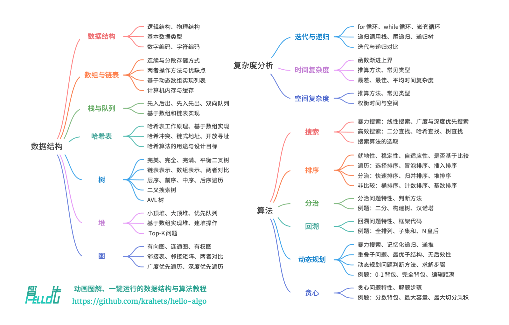

# Hello 算法 （Java 版）



1. 当涉及编程语言之间不一致的名词时，本书均以 Python 为准，例如使用 None 来表示“空”。

## 第 1 章  初识算法

1. 许多编程语言的排序库函数中都有插入排序的身影。  
     “插入排序”算法在处理小型数据集时非常高效。
2. 算法(algorithm)是在有限时间内解决特定问题的一组指令或操作步骤，它具有以下特性：  
    问题是明确的，包含清晰的输入和输出定义。  
    具有可行性，能够在有限步骤、时间和内存空间下完成。  
    各步骤都有确定的含义，在相同的输入和运行条件下，输出始终相同。
3. 数据结构(data structure)是计算机中组织和存储数据的方式，具有以下设计目标：  
    空间占用尽量少，以节省计算机内存。  
    数据操作尽可能快速，涵盖数据访问、添加、删除、更新等。  
    提供简洁的数据表示和逻辑信息，以便算法高效运行。
4. 数据结构设计是一个充满权衡的过程。如果想在某方面取得提升，往往需要在另一方面作出妥协。
5. 算法通常可以基于不同的数据结构实现，但执行效率可能相差很大，选择合适的数据结构是关键。
6. 数据结构与算法是独立于编程语言的。

## 第 2 章  复杂度分析

1. 我们的目标是设计“既快又省”的数据结构与算法。
2. 效率评估方法主要分为两种：实际测试、理论估算。
3. 复杂度分析能够体现算法运行所需的时间和空间资源与输入数据大小之间的关系。  
    它描述了随着输入数据大小的增加，算法执行所需时间和空间的增长趋势。
4. 递归调用函数会产生额外的开销。  
    递归通常比循环的时间效率更低。  
    递归通常比迭代更加耗费内存空间。  
    在实际中，编程语言允许的递归深度通常是有限的，过深的递归可能导致栈溢出错误。
5. 如果函数在返回前的最后一步才进行递归调用，则该函数可以被编译器或解释器优化，使其在空间效率上与迭代相当。  
    这种情况被称为「尾递归 tail recursion」。  
    尾递归：递归调用是函数返回前的最后一个操作，这意味着函数返回到上一层级后，无须继续执行其他操作，因此系统无须保存上一层函数的上下文。  
    请注意，许多编译器或解释器并不支持尾递归优化。  
    理论上，尾递归函数的空间复杂度可以优化至 𝑂(1) 。不过绝大多数编程语言（例如 Java、Python、C++、Go、C# 等）不支持自动优化尾递归，因此通常认为空间复杂度是 𝑂(𝑛) 。  
    Python 默认不支持尾递归优化，因此即使函数是尾递归形式，仍然可能会遇到栈溢出问题。
6. 选择迭代还是递归取决于特定问题的性质。  
    在编程实践中，权衡两者的优劣并根据情境选择合适的方法至关重要。
7. 时间复杂度分析统计的不是算法运行时间，而是算法运行时间随着数据量变大时的增长趋势。
8. 函数渐近上界：  
    若存在正实数 𝑐 和实数 𝑛0 ，使得对于所有的 𝑛 > 𝑛0 ，均有 𝑇(𝑛) ≤ 𝑐 ⋅ 𝑓(𝑛) ，则可认为 𝑓(𝑛) 给出了 𝑇(𝑛) 的一个渐近上界，记为 𝑇(𝑛) = 𝑂(𝑓(𝑛)) 。
9. 时间复杂度推算步骤：  
    忽略 𝑇(𝑛) 中的常数项。  
    省略所有系数。  
    循环嵌套时使用乘法。  
    时间复杂度由 𝑇(𝑛) 中最高阶的项来决定。
10. 常见的时间复杂度：

    ```text
        𝑂(1) < 𝑂(log 𝑛) < 𝑂(𝑛) < 𝑂(𝑛 log 𝑛) < 𝑂(𝑛2) < 𝑂(2𝑛) < 𝑂(𝑛!)
        常数阶 < 对数阶 < 线性阶 < 线性对数阶 < 平方阶 < 指数阶 < 阶乘阶
        常数阶的操作数量与输入数据大小 𝑛 无关，即不随着 𝑛 的变化而变化。
        线性阶的操作数量相对于输入数据大小 𝑛 以线性级别增长。线性阶通常出现在单层循环中。
        平方阶的操作数量相对于输入数据大小 𝑛 以平方级别增长。平方阶通常出现在嵌套循环中，外层循环和内层循环的时间复杂度都为 𝑂(𝑛) ，因此总体的时间复杂度为 𝑂(𝑛2) 。
        在实际算法中，指数阶常出现于递归函数中。
            指数阶增长非常迅速，在穷举法（暴力搜索、回溯等）中比较常见。对于数据规模较大的问题，指数阶是不可接受的，通常需要使用动态规划或贪心算法等来解决。
        与指数阶相反，对数阶反映了“每轮缩减到一半”的情况。
            与指数阶类似，对数阶也常出现于递归函数中。
            对数阶常出现于基于分治策略的算法中，体现了“一分为多”和“化繁为简”的算法思想。它增长缓慢，是仅次于常数阶的理想的时间复杂度。
        𝑂(log 𝑛) 的底数是多少？
            准确来说，“一分为 𝑚”对应的时间复杂度是 𝑂(log𝑚𝑛) 。而通过对数换底公式，我们可以得到具有不同底数、相等的时间复杂度：
            𝑂(log𝑚𝑛) = 𝑂(log𝑘𝑛 / log𝑘𝑚) = 𝑂(log𝑘𝑛)
            也就是说，底数 𝑚 可以在不影响复杂度的前提下转换。因此我们通常会省略底数 𝑚 ，将对数阶直接记为 𝑂(log 𝑛) 。
        主流排序算法的时间复杂度通常为 𝑂(𝑛 log𝑛) ，例如快速排序、归并排序、堆排序等。
        阶乘阶对应数学上的“全排列”问题。给定 𝑛 个互不重复的元素，求其所有可能的排列方案，方案数量为：
            𝑛! = 𝑛 × (𝑛 − 1) × (𝑛 − 2) × ⋯ × 2 × 1
            阶乘通常使用递归实现。
            当 𝑛 ≥ 4 时恒有 𝑛! > 2𝑛 ，所以阶乘阶比指数阶增长得更快，在 𝑛 较大时也是不可接受的。
    ```

11. 算法的时间效率往往不是固定的，而是与输入数据的分布有关。  
    “最差时间复杂度”对应函数渐近上界，使用大 𝑂 记号表示。  
    “最佳时间复杂度”对应函数渐近下界，用 Ω 记号表示。  
    平均时间复杂度可以体现算法在随机输入数据下的运行效率，用 Θ 记号来表示。  
    我们在实际中很少使用最佳时间复杂度，因为通常只有在很小概率下才能达到，可能会带来一定的误导性。  
    而最差时间复杂度更为实用，因为它给出了一个效率安全值，让我们可以放心地使用算法。
12. 在分析一段程序的空间复杂度时，我们通常统计暂存数据、栈帧空间和输出数据三部分。  
    在递归函数中，需要注意统计栈帧空间。  
    需要注意的是，在循环中初始化变量或调用函数而占用的内存，在进入下一循环后就会被释放，因此不会累积占用空间，空间复杂度仍为 𝑂(1) 。
13. 理想情况下，我们希望算法的时间复杂度和空间复杂度都能达到最优。然而在实际情况中，同时优化时间复杂度和空间复杂度通常非常困难。  
    降低时间复杂度通常需要以提升空间复杂度为代价，反之亦然。  
    我们将牺牲内存空间来提升算法运行速度的思路称为“以空间换时间”；反之，则称为“以时间换空间”。  
    选择哪种思路取决于我们更看重哪个方面。在大多数情况下，时间比空间更宝贵，因此“以空间换时间”通常是更常用的策略。  
    当然，在数据量很大的情况下，控制空间复杂度也非常重要。  
    栈帧空间通常仅在递归函数中影响空间复杂度。  
    我们通常只关注最差空间复杂度，即统计算法在最差输入数据和最差运行时刻下的空间复杂度。

## 第 3 章  数据结构

1. 内存是所有程序的共享资源，当某块内存被某个程序占用时，则无法被其他程序同时使用。  
    在数据结构与算法的设计中，内存资源是一个重要的考虑因素。  
    算法所占用的内存峰值不应超过系统剩余空闲内存。  
    如果缺少连续大块的内存空间，那么所选用的数据结构必须能够存储在分散的内存空间内。
2. 所有数据结构都是基于数组、链表或二者的组合实现的。  
    栈和队列既可以使用数组实现，也可以使用链表实现。  
    哈希表的实现可能同时包含数组和链表。
3. 基本数据类型提供了数据的“内容类型”，而数据结构提供了数据的“组织方式”。
4. 数字是以“补码”的形式存储在计算机中的。  
    原码：我们将数字的二进制表示的最高位视为符号位，其中 0 表示正数，1 表示负数，其余位表示数字的值。  
    反码：正数的反码与其原码相同，负数的反码是对其原码除符号位外的所有位取反。  
    补码：正数的补码与其原码相同，负数的补码是在其反码的基础上加 1 。
5. 计算机内部的硬件电路主要是基于加法运算设计的。  
    加法运算相对于其他运算（比如乘法、除法和减法）来说，硬件实现起来更简单，更容易进行并行化处理，运算速度更快。  
    请注意，这并不意味着计算机只能做加法。通过将加法与一些基本逻辑运算结合，计算机能够实现各种其他的数学运算。
6. float 的表示方式包含指数位，导致其取值范围远大于 int 。  
    尽管浮点数 float 扩展了取值范围，但其副作用是牺牲了精度。  
    整数类型 int 将全部 32 比特用于表示数字，数字是均匀分布的。  
    由于指数位的存在，浮点数 float 的数值越大，相邻两个数字之间的差值就会趋向越大。

    

7. 指数位 𝐸 = 0 和 𝐸 = 255 具有特殊含义，用于表示零、无穷大、NaN 等。

    

    值得说明的是，次正规数显著提升了浮点数的精度。最小正正规数为 $2^{−126}$ ，最小正次正规数为 $2^{−126}×2^{−23}$

8. Unicode 是一种通用字符集，本质上是给每个字符分配一个编号（称为“码点”），但它并没有规定在计算机中如何存储这些字符码点。
9. 目前，UTF-8 已成为国际上使用最广泛的 Unicode 编码方法。

    ```text
        它是一种可变长度的编码，使用 1 到 4 字节来表示一个字符，根据字符的复杂性而变。
        ASCII 字符只需 1 字节，拉丁字母和希腊字母需要 2 字节，常用的中文字符需要 3 字节，其他的一些生僻字符需要 4 字节。
        UTF-8 的编码规则并不复杂，分为以下两种情况：
            对于长度为 1 字节的字符，将最高位设置为 0 ，其余 7 位设置为 Unicode 码点。
                值得注意的是，ASCII字符在 Unicode 字符集中占据了前 128 个码点。
                也就是说，UTF-8 编码可以向下兼容 ASCII 码。
                这意味着我们可以使用 UTF-8 来解析年代久远的 ASCII 码文本。
            对于长度为 𝑛 字节的字符（其中 𝑛 > 1）：
                将首个字节的高 𝑛 位都设置为 1 ，第 𝑛 + 1 位设置为 0 。
                从第二个字节开始，将每个字节的高 2 位都设置为 10 。
                其余所有位用于填充字符的 Unicode 码点。
        从存储空间占用的角度看，使用 UTF-8 表示英文字符非常高效，因为它仅需 1 字节；使用 UTF-16 编码某些非英文字符（例如中文）会更加高效，因为它仅需 2 字节，而 UTF-8 可能需要 3 字节。
        从兼容性的角度看，UTF-8 的通用性最佳，许多工具和库优先支持 UTF-8 。
        在文件存储或网络传输中，我们通常会将字符串编码为 UTF-8 格式，以达到最优的兼容性和空间效率。
    ```

10. 数据结构可以从逻辑结构和物理结构两个角度进行分类。  
    逻辑结构描述了数据元素之间的逻辑关系，而物理结构描述了数据在计算机内存中的存储方式。  
    物理结构主要分为连续空间存储（数组）和分散空间存储（链表）。  
    所有数据结构都是由数组、链表或两者的组合实现的。
11. UTF-8 是最受欢迎的 Unicode 编码方法，通用性非常好。  
    它是一种变长的编码方法，具有很好的扩展性，有效提升了存储空间的使用效率。  
    UTF-16 和 UTF-32 是等长的编码方法。  
    在编码中文时，UTF-16占用的空间比 UTF-8 更小。  
    Java 和 C# 等编程语言默认使用 UTF-16 编码。

## 第 4 章  数组与链表

0. 数组和链表是两种基本的数据结构，分别代表数据在计算机内存中的两种存储方式：连续空间存储和分散空间存储。  
    数组支持随机访问、占用内存较少；但插入和删除元素效率低，且初始化后长度不可变。  
    链表通过更改引用（指针）实现高效的节点插入与删除，且可以灵活调整长度；但节点访问效率低、占用内存较多。
1. 数组的优点与局限性：

    ```text
        存储数组的内存空间是连续的。
        索引本质上是内存地址的偏移量。首个元素的地址偏移量是 0 ，因此它的索引为 0 是合理的。
        优点：
            空间效率高：数组为数据分配了连续的内存块，无须额外的结构开销。
            支持随机访问：数组允许在 𝑂(1) 时间内访问任何元素。
            缓存局部性：当访问数组元素时，计算机不仅会加载它，还会缓存其周围的其他数据，从而借助高速缓存来提升后续操作的执行速度。
        局限性：
            插入与删除效率低：当数组中元素较多时，插入与删除操作需要移动大量的元素。
                数组的插入和删除的平均时间复杂度均为 𝑂(𝑛) 。
            长度不可变：数组在初始化后长度就固定了，扩容数组需要将所有数据复制到新数组，开销很大。
            空间浪费：如果数组分配的大小超过实际所需，那么多余的空间就被浪费了。
    ```

2. 链表是一种线性数据结构，其中的每个元素都是一个节点对象，各个节点通过“引用”相连接。  
    链表的设计使得各个节点可以分散存储在内存各处，它们的内存地址无须连续。  
    链表的首个节点被称为“头节点”，最后一个节点被称为“尾节点”。  
    在相同数据量下，链表比数组占用更多的内存空间。  
    链表插入和删除元素需要 O(1) 的时间，但访问节点需要 O(n) 的时间复杂度。  
    常见的链表类型包括三种：单向链表、双向链表、环形链表。
3. 许多编程语言中的标准库提供的列表是基于动态数组实现的。  
    列表本质上是数组，因此可以在 𝑂(1) 时间内访问和更新元素，效率很高。  
    相较于数组，列表可以自由地添加与删除元素。  
    在列表尾部添加元素的时间复杂度为 𝑂(1) ，但插入和删除元素的效率仍与数组相同，时间复杂度为 𝑂(𝑛) 。
4. 物理结构在很大程度上决定了程序对内存和缓存的使用效率，进而影响算法程序的整体性能。  
    在当前技术下，多层级的缓存结构是容量、速度和成本之间的最佳平衡点。
5. 在程序运行时，随着反复申请与释放内存，空闲内存的碎片化程度会越来越高，从而导致内存的利用效率降低。  
    数组由于其连续的存储方式，相对不容易导致内存碎片化。  
    相反，链表的元素是分散存储的，在频繁的插入与删除操作中，更容易导致内存碎片化。
6. 总体而言，数组具有更高的缓存命中率，因此它在操作效率上通常优于链表。  
    这使得在解决算法问题时，基于数组实现的数据结构往往更受欢迎。  
    需要注意的是，高缓存效率并不意味着数组在所有情况下都优于链表。  
    实际应用中选择哪种数据结构，应根据具体需求来决定。  
    在做算法题时，我们会倾向于选择基于数组实现的栈。

## 第 5 章  栈与队列

1. 栈是一种遵循先入后出原则的数据结构，可通过数组或链表来实现。  
    栈遵循先入后出的原则，因此我们只能在栈顶添加或删除元素。然而，数组和链表都可以在任意位置添加和删除元素，因此栈可以视为一种受限制的数组或链表。  
    在时间效率方面，栈的数组实现具有较高的平均效率，但在扩容过程中，单次入栈操作的时间复杂度会劣化至 𝑂(𝑛) 。相比之下，栈的链表实现具有更为稳定的效率表现。  
    在空间效率方面，栈的数组实现可能导致一定程度的空间浪费。但需要注意的是，链表节点所占用的内存空间比数组元素更大。
2. 队列是一种遵循先入先出原则的数据结构，同样可以通过数组或链表来实现。在时间效率和空间效率的对比上，队列的结论与前述栈的结论相似。  
    双向队列是一种具有更高自由度的队列，它允许在两端进行元素的添加和删除操作。  
    双向队列兼具栈与队列的逻辑，因此它可以实现这两者的所有应用场景，同时提供更高的自由度。
3. 撤销（undo）和反撤销（redo）具体是如何实现的？  
    使用两个栈，栈 A 用于撤销，栈 B 用于反撤销。  
    1. 每当用户执行一个操作，将这个操作压入栈 A ，并清空栈 B 。  
    2. 当用户执行“撤销”时，从栈 A 中弹出最近的操作，并将其压入栈 B 。  
    3. 当用户执行“反撤销”时，从栈 B 中弹出最近的操作，并将其压入栈 A 。

## 第 6 章  哈希表

1. 哈希表(hash table)，又称散列表，它通过建立键 key 与值 value 之间的映射，实现高效的元素查询。  
    具体而言，我们向哈希表中输入一个键 key ，则可以在 𝑂(1) 时间内获取对应的值 value 。  
    在哈希表中进行增删查改的时间复杂度都是 𝑂(1) ，非常高效。
2. 从本质上看，哈希函数的作用是将所有 key 构成的输入空间映射到数组所有索引构成的输出空间，而输入空间往往远大于输出空间。因此，理论上一定存在“多个输入对应相同输出”的情况。  
    通常情况下哈希函数的输入空间远大于输出空间，因此理论上哈希冲突是不可避免的。  
    无论是开放寻址还是链式地址，它们只能保证哈希表可以在发生冲突时正常工作，而无法减少哈希冲突的发生。
3. 负载因子(load factor) 是哈希表的一个重要概念，其定义为哈希表的元素数量除以桶数量，用于衡量哈希冲突的严重程度，也常作为哈希表扩容的触发条件。  
    例如在 Java 中，当负载因子超过 0.75 时，系统会将哈希表扩容至原先的 2 倍。
4. 在许多编程语言中，只有不可变对象才可作为哈希表的 key 。  
    编程语言通常会为数据类型提供内置哈希算法，用于计算哈希表中的桶索引。通常情况下，只有不可变对象是可哈希的。  
    假如我们将列表（动态数组）作为 key ，当列表的内容发生变化时，它的哈希值也随之改变，我们就无法在哈希表中查询到原先的 value 了。
5. Python 解释器在每次启动时，都会为字符串哈希函数加入一个随机的盐（salt）值。  
    这种做法可以有效防止 HashDoS 攻击，提升哈希算法的安全性。
6. 在哈希表中，我们希望哈希算法具有确定性、高效率和均匀分布的特点。在密码学中，哈希算法还应该具备抗碰撞性和雪崩效应。
7. 哈希算法通常采用大质数作为模数，以最大化地保证哈希值均匀分布，减少哈希冲突。
8. 常见的哈希算法包括 MD5、SHA‑1、SHA‑2 和 SHA‑3 等。  
    MD5 常用于校验文件完整性，SHA‑2 常用于安全应用与协议。
9. 多次哈希是开放寻址的一种，开放寻址法都有不能直接删除元素的缺陷，需要通过标记删除。  
    标记为已删除的空间可以再次使用。当将新元素插入哈希表，并且通过哈希函数找到标记为已删除的位置时，该位置可以被新元素使用。  
    这样做既能保持哈希表的探测序列不变，又能保证哈希表的空间使用率。

## 第 7 章  树

1. 常见术语：

    ```text
        节点的度：节点的子节点的数量。在二叉树中，度的取值范围是 0、1、2 。
        节点高度：节点到它的最远叶节点的距离，即所经过的“边”的数量。叶节点的高度为 0 ，而空节点的高度为 −1 。
        叶子节点：也称为终端节点，没有子树的节点或者度为零的节点。
        树的度：树中所有节点的度的最大值。
        节点的层次：从根节点开始，假设根节点为第1层，根节点的子节点为第2层，依此类推，如果某一个节点位于第L层，则其子节点位于第L+1层。
        树的深度：也称为树的高度，树中所有节点的层次最大值称为树的深度。
        森林：由m（m≥0）棵互不相交的树构成一片森林。如果把一棵非空的树的根节点删除，则该树就变成了一片森林，森林中的树由原来根节点的各棵子树构成。
    ```

2. 二叉树（binary tree）是指树中节点的度不大于2的有序树，它是一种最简单且最重要的树。  
    二叉树的递归定义为：二叉树是一棵空树，或者是一棵由一个根节点和两棵互不相交的，分别称作根的左子树和右子树组成的非空树；左子树和右子树又同样都是二叉树。

    ```text
        二叉树的第i层上至多有 2^(i-1)（i≥1）个节点。
        深度为h的二叉树中至多含有 2^h-1 个节点。
        若在任意一棵二叉树中，有n0个叶子节点，有n2个度为2的节点，则必有 n0=n2+1 。
        具有n个节点的满二叉树深为 log_2(n+1) 。
        对于完全二叉树：若某节点的索引为 𝑖 ，则该节点的左子节点索引为 2𝑖 + 1 ，右子节点索引为 2𝑖 + 2 。
    ```

3. 在最佳结构和最差结构下，二叉树的叶节点数量、节点总数、高度等达到极大值或极小值。

    

4. 所谓遍历二叉树，就是按一定的规则和顺序走遍二叉树的所有节点，使每一个节点都被访问一次，而且只被访问一次。  
    由于二叉树是非线性结构，因此，树的遍历实质上是将二叉树的各个节点转换成为一个线性序列来表示。  
    二叉树的层序遍历是广度优先遍历，通常借助“队列”来实现。  
    前序、中序、后序遍历皆属于深度优先搜索，它们体现了“先走到尽头，再回溯继续”的遍历方式，通常使用递归来实现。
5. 常见二叉树类型：

    ```text
        完美二叉树（perfect binary tree）所有层的节点都被完全填满。
            在完美二叉树中，叶节点的度为 0 ，其余所有节点的度都为 2 。
            若树的高度为 ℎ ，则节点总数为 2^(ℎ+1) − 1 ，呈现标准的指数级关系，反映了自然界中常见的细胞分裂现象。
            完美二叉树常被称为满二叉树。
            完美二叉树是最理想的状态，而链表是退化后的最差状态。
        完全二叉树（complete binary tree）只有最底层的节点未被填满，且最底层节点尽量靠左填充。
        完满二叉树（full binary tree）除了叶节点之外，其余所有节点都有两个子节点。
        平衡二叉树（balanced binary tree）中任意节点的左子树和右子树的高度之差的绝对值不超过 1 。
    ```

6. 完全二叉树非常适合使用数组来表示。  
    回顾完全二叉树的定义，None 只出现在最底层且靠右的位置，因此所有 None 一定出现在层序遍历序列的末尾。  
    这意味着使用数组表示完全二叉树时，可以省略存储所有 None ，非常方便。
7. 二叉查找树（Binary Search Tree）（又称二叉搜索树，二叉排序树）它或者是一棵空树，或者是具有下列性质的二叉树：  
    若它的左子树不空，则左子树上所有结点的值均小于它的根结点的值；  
    若它的右子树不空，则右子树上所有结点的值均大于它的根结点的值；  
    它的左、右子树也分别为二叉排序树。  
    二叉搜索树的中序遍历序列是升序的。利用中序遍历升序的性质，我们在二叉搜索树中获取有序数据仅需 𝑂(𝑛) 时间，无须进行额外的排序操作，非常高效。
8. 二叉搜索树的查找操作与二分查找算法的工作原理一致，都是每轮排除一半情况。循环次数最多为二叉树的高度，当二叉树平衡时，使用 𝑂(log 𝑛) 时间。  
    二叉搜索树是一种高效的元素查找数据结构，其查找、插入和删除操作的时间复杂度均为 𝑂(log 𝑛) 。 当二叉搜索树退化为链表时，各项时间复杂度会劣化至 𝑂(𝑛) 。
9. 在代码实现中，需要注意以下两点：  
    二叉搜索树不允许存在重复节点，否则将违反其定义。因此，若待插入节点在树中已存在，则不执行插入，直接返回。  
    为了实现插入节点，我们需要借助节点 pre 保存上一轮循环的节点。这样在遍历至 None 时，我们可以获取到其父节点，从而完成节点插入操作。  
    当待删除节点的度为 2 时，我们无法直接删除它，而需要使用一个节点替换该节点。由于要保持二叉搜索树 “左子树 < 根节点 < 右子树” 的性质，因此这个节点可以是右子树的最小节点或左子树的最大节点。
10. AVL 树是一种平衡的二叉搜索树。  
    每个节点的左右子树的高度之差的绝对值（平衡因子）最多为 1 。设平衡因子为 𝑓 ，则一棵 AVL 树的任意节点的平衡因子皆满足 −1 ≤ 𝑓 ≤ 1 。  
    节点的平衡因子（balance factor）定义为节点左子树的高度减去右子树的高度，同时规定空节点的平衡因子为 0 。
11. AVL 树的特点在于“旋转”操作，它能够在不影响二叉树的中序遍历序列的前提下，使失衡节点重新恢复平衡。换句话说，旋转操作既能保持“二叉搜索树”的性质，也能使树重新变为“平衡二叉树”。  
    我们将平衡因子绝对值 > 1 的节点称为“失衡节点”。根据节点失衡情况的不同，AVL 树的旋转操作包括右旋、左旋、先右旋再左旋、先左旋再右旋。  
    AVL 树的节点插入操作与二叉搜索树在主体上类似。唯一的区别在于，在 AVL 树中插入或删除节点后，从该节点到根节点的路径上可能会出现一系列失衡节点。因此，我们需要从这个节点开始，自底向上执行旋转操作，使所有失衡节点恢复平衡。
12. AVL 树的典型应用：  
    组织和存储大型数据，适用于高频查找、低频增删的场景。  
    用于构建数据库中的索引系统。  
    红黑树在许多应用中比 AVL 树更受欢迎。这是因为红黑树的平衡条件相对宽松，在红黑树中插入与删除节点所需的旋转操作相对较少，其节点增删操作的平均效率更高。

## 第 8 章  堆

1. 堆是一棵完全二叉树，根据成立条件可分为大顶堆和小顶堆。  
    大（小）顶堆的堆顶元素是最大（小）的。  
    优先队列的定义是具有出队优先级的队列，通常使用堆来实现。
2. 完全二叉树非常适合用数组表示，因此我们通常使用数组来存储堆。  
    给定索引 𝑖 ，其左子节点的索引为 2𝑖 + 1 ，右子节点的索引为 2𝑖 + 2 ，父节点的索引为 (𝑖 − 1) / 2（向下整除）。  
    节点指针通过索引映射公式来实现。当索引越界时，表示空节点或节点不存在。
3. 堆的常用操作及其对应的时间复杂度：  
    元素入堆 𝑂(log 𝑛) ；  
    堆顶元素出堆 𝑂(log 𝑛) ；  
    访问堆顶元素 𝑂(1) ；  
    堆化建堆 𝑂(𝑛) 。
4. 堆化操作用于维护堆的性质，在入堆和出堆操作中都会用到。
5. 元素入堆操作：

    ```text
        给定元素 val ，我们首先将其添加到堆底。
        添加之后，由于 val 可能大于堆中其他元素，堆的成立条件可能已被破坏，因此需要修复从插入节点到根节点的路径上的各个节点，这个操作被称为 堆化（heapify）。
        设节点总数为 𝑛 ，则树的高度为 𝑂(log 𝑛) 。由此可知，堆化操作的循环轮数最多为 𝑂(log 𝑛) ，元素入堆操作的时间复杂度为 𝑂(log 𝑛) 。
    ```

6. 堆顶元素出堆操作：  
    堆顶元素是二叉树的根节点，即列表首元素。如果我们直接从列表中删除首元素，那么二叉树中所有节点的索引都会发生变化，这将使得后续使用堆化进行修复变得困难。为了尽量减少元素索引的变动，我们采用以下操作步骤。

    ```text
        交换堆顶元素与堆底元素（交换根节点与最右叶节点）。
        交换完成后，将堆底从列表中删除（注意，由于已经交换，因此实际上删除的是原来的堆顶元素）。
        从根节点开始，从顶至底执行堆化。
        “从顶至底堆化”的操作方向与“从底至顶堆化”相反，我们将根节点的值与其两个子节点的值进行比较，将最大的子节点与根节点交换。然后循环执行此操作，直到越过叶节点或遇到无须交换的节点时结束。
        与元素入堆操作相似，堆顶元素出堆操作的时间复杂度也为 𝑂(log 𝑛) 。
    ```

7. 建堆操作：

    ```text
        借助入堆操作实现：
            我们首先创建一个空堆，然后遍历列表，依次对每个元素执行“入堆操作”，即先将元素添加至堆的尾部，再对该元素执行“从底至顶”堆化。
            每当一个元素入堆，堆的长度就加一。由于节点是从顶到底依次被添加进二叉树的，因此堆是“自上而下”构建的。
            设元素数量为 𝑛 ，每个元素的入堆操作使用 𝑂(log 𝑛) 时间，因此该建堆方法的时间复杂度为 𝑂(𝑛 log 𝑛) 。
        通过遍历堆化实现：
            将列表所有元素原封不动地添加到堆中，此时堆的性质尚未得到满足。
            倒序遍历堆（层序遍历的倒序），依次对每个非叶节点执行“从顶至底堆化”。
            每当堆化一个节点后，以该节点为根节点的子树就形成一个合法的子堆。而由于是倒序遍历，因此堆是“自下而上”构建的。

            之所以选择倒序遍历，是因为这样能够保证当前节点之下的子树已经是合法的子堆，这样堆化当前节点才是有效的。
            值得说明的是，由于叶节点没有子节点，因此它们天然就是合法的子堆，无须堆化。我们从最后一个节点的父节点开始倒序遍历并执行堆化。
            将上述两者相乘，可得到建堆过程的时间复杂度为 𝑂(𝑛 log 𝑛) 。但这个估算结果并不准确，因为我们没有考虑到二叉树底层节点数量远多于顶层节点的性质。实际输入列表并建堆的时间复杂度为 𝑂(𝑛) ，非常高效。
    ```

8. 堆的常见应用：  
    优先队列：堆通常作为实现优先队列的首选数据结构，其入队和出队操作的时间复杂度均为 𝑂(log 𝑛)，而建队操作为 𝑂(𝑛) ，这些操作都非常高效。  
    堆排序：给定一组数据，我们可以用它们建立一个堆，然后不断地执行元素出堆操作，从而得到有序数据。  
    获取最大的 𝑘 个元素：这是一个经典的算法问题，同时也是一种典型应用，例如选择热度前 10 的新闻，选取销量前 10 的商品等。
9. Top k 是一个经典算法问题，可以使用堆数据结构高效解决，时间复杂度为 𝑂(𝑛 log 𝑘) 。

    ```text
        方法一：遍历选择
            我们可以进行 𝑘 轮遍历，分别在每轮中提取第 1、2、…、𝑘 大的元素，时间复杂度为 𝑂(𝑛𝑘) 。
        方法二：排序
            我们可以先对数组 nums 进行排序，再返回最右边的 𝑘 个元素，时间复杂度为 𝑂(𝑛 log 𝑛) 。
        方法三：堆
            初始化一个小顶堆，其堆顶元素最小。
            先将数组的前 𝑘 个元素依次入堆。
            从第 𝑘 + 1 个元素开始，若当前元素大于堆顶元素，则将堆顶元素出堆，并将当前元素入堆。
            遍历完成后，堆中保存的就是最大的 𝑘 个元素。

            总共执行了 𝑛 轮入堆和出堆，堆的最大长度为 𝑘 ，因此时间复杂度为 𝑂(𝑛 log 𝑘) 。
                该方法的效率很高，当 𝑘 较小时，时间复杂度趋向 𝑂(𝑛) ；
                当 𝑘 较大时，时间复杂度不会超过 𝑂(𝑛 log 𝑛) 。
            另外，该方法适用于动态数据流的使用场景。
                在不断加入数据时，我们可以持续维护堆内的元素，从而实现最大的 𝑘 个元素的动态更新。
    ```

## 第 9 章  图

1. 图（graph）是一种非线性数据结构，由顶点（vertex）和（边 edge）组成。  
    我们可以将图 𝐺 抽象地表示为一组顶点 𝑉 和一组边 𝐸 的集合。  
    相较于线性关系（链表）和分治关系（树），网络关系（图）的自由度更高，因而更为复杂。  
    图的常用表示方式包括 “邻接矩阵” 和 “邻接表” 。
2. 图数据结构的常用术语：  
    邻接（adjacency）：当两顶点之间存在边相连时，称这两顶点 “邻接”。  
    路径（path）：从顶点 A 到顶点 B 经过的边构成的序列被称为从 A 到 B 的 “路径”。  
    度（degree）：一个顶点拥有的边数。对于有向图，入度（in‑degree）表示有多少条边指向该顶点，出度（out‑degree）表示有多少条边从该顶点指出。
3. 设图的顶点数量为 𝑛 ，邻接矩阵（adjacency matrix）使用一个 𝑛 × 𝑛 大小的矩阵来表示图，每一行（列）代表一个顶点，矩阵元素代表边，用 1 或 0 表示两个顶点之间是否存在边。

    ```text
        邻接矩阵具有以下特性：
            顶点不能与自身相连，因此邻接矩阵主对角线元素没有意义。
            对于无向图，两个方向的边等价，此时邻接矩阵关于主对角线对称。
            将邻接矩阵的元素从 1 和 0 替换为权重，则可表示有权图。
        使用邻接矩阵表示图时，我们可以直接访问矩阵元素以获取边，因此增删查改操作的效率很高，时间复杂度均为 𝑂(1) 。然而，矩阵的空间复杂度为 𝑂(𝑛^2) ，内存占用较多。
    ```

4. 邻接表（adjacency list）使用 𝑛 个链表来表示图，链表节点表示顶点。第 𝑖 个链表对应顶点 𝑖 ，其中存储了该顶点的所有邻接顶点（与该顶点相连的顶点）。  
    邻接表仅存储实际存在的边，而边的总数通常远小于 𝑛^2 ，因此它更加节省空间。然而，在邻接表中需要通过遍历链表来查找边，因此其时间效率不如邻接矩阵。  
    邻接表结构与哈希表中的 “链式地址” 非常相似，因此我们也可以采用类似的方法来优化效率。比如当链表较长时，可以将链表转化为 AVL 树或红黑树，从而将时间效率从 𝑂(𝑛) 优化至 𝑂(log 𝑛) 。还可以把链表转换为哈希表，从而将时间复杂度降至 𝑂(1) 。
5. 邻接矩阵与邻接表对比：

    

    似乎邻接表（哈希表）的时间效率与空间效率最优。但实际上，在邻接矩阵中操作边的效率更高，只需一次数组访问或赋值操作即可。  
    从算法思想的角度分析，邻接矩阵体现了“以空间换时间”，邻接表体现了“以时间换空间”。
6. 图的广度优先遍历是一种由近及远、层层扩张的搜索方式，通常借助队列实现。  
    广度优先遍历是一种由近及远的遍历方式，从某个节点出发，始终优先访问距离最近的顶点，并一层层向外扩张。  
    BFS 通常借助队列来实现。队列具有 “先入先出” 的性质，这与 BFS 的 “由近及远” 的思想异曲同工。  
    时间复杂度：所有顶点都会入队并出队一次，使用 𝑂(|𝑉|) 时间；在遍历邻接顶点的过程中，由于是无向图，因此所有边都会被访问 2 次，使用 𝑂(2|𝐸|) 时间；总体使用 𝑂(|𝑉|+|𝐸|) 时间。  
    空间复杂度：队列中的顶点数量最多为 |𝑉| ，使用 𝑂(|𝑉|) 空间。
7. 图的深度优先遍历是一种优先走到底、无路可走时再回溯的搜索方式，常基于递归来实现。  
    与广度优先遍历类似，在深度优先遍历中，我们也需要借助一个哈希表 visited 来记录已被访问的顶点，以避免重复访问顶点。  
    时间复杂度：所有顶点都会被访问 1 次，使用 𝑂(|𝑉|) 时间；所有边都会被访问 2 次，使用 𝑂(2|𝐸|) 时间；总体使用 𝑂(|𝑉|+|𝐸|) 时间。  
    空间复杂度：顶点数量最多为 |𝑉| ，递归深度最大为 |𝑉| ，因此使用 𝑂(|𝑉|) 空间。
8. 广度优先遍历的序列是否唯一？  
    不唯一。广度优先遍历只要求按 “由近及远” 的顺序遍历，而多个相同距离的顶点的遍历顺序允许被任意打乱。  
    深度优先遍历的序列是否唯一？  
    与广度优先遍历类似，深度优先遍历序列的顺序也不是唯一的。给定某顶点，先往哪个方向探索都可以，即邻接顶点的顺序可以任意打乱，都是深度优先遍历。
