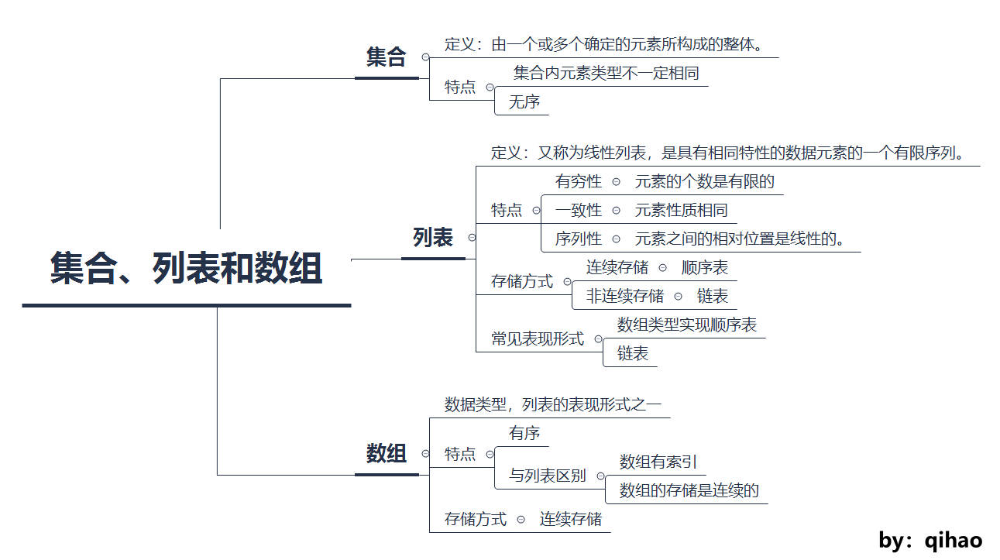

# 数组和字符串

1. 集合一般被定义为：由一个或多个确定的元素所构成的整体。  
    集合里的元素类型不一定相同。  
    集合里的元素没有顺序。
2. 列表（又称线性列表）的定义为：是一种数据项构成的有限序列，即按照一定的线性顺序，排列而成的数据项的集合。  
    在编程语言中，列表最常见的表现形式有数组和链表，而我们熟悉的栈和队列则是两种特殊类型的列表。
3. 在具体的编程语言中，数组这个数据结构的实现方式具有一定差别。比如 C++ 和 Java 中，数组中的元素类型必须保持一致，而 Python 中则可以不同。  
    我们可以根据数组中的索引，快速访问数组中的元素。  
    数组中的元素在内存中是连续存储的，且每个元素占用相同大小的内存。

    

4. 数组的操作:  
    数组读取元素的时间复杂度是常数级别，为 O(1)  
    查找元素的时间复杂度为 O(N)  
    插入、删除操作的时间复杂度为 O(N)
5. 如果需要频繁地对数组元素进行插入操作，会造成时间的浪费。事实上，另一种数据结构，即链表可以有效解决这个问题。
