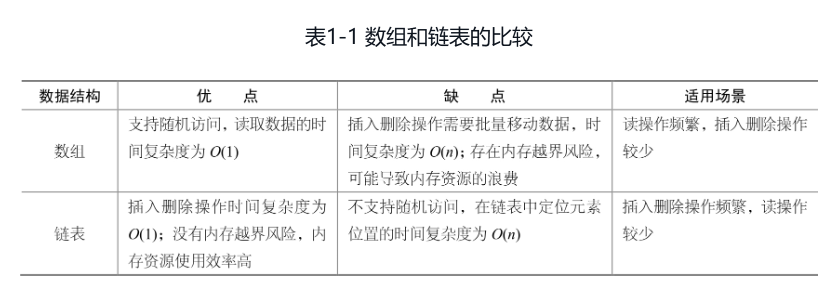

# 算法大爆炸：面试通关步步为营

## 第 1 章  线性结构



1. 数组(Array)是最简单的数据结构，是由有限个相同类型的变量（或对象）组成的有序集合。  
    数组的内存单元是连续的，一个数组要占据一个地址连续的内存空间。
2. 链表也是一种常用的线性数据结构，与数组不同的是，链表的存储空间并不连续，它是用一组地址任意的存储单元来存放数据的，也就是将存储单元分散在内存的各个地址上。  
    链表在逻辑上是连续的，而在物理上并不一定连续，链表节点可能分散在内存的各个地址上。
3. 栈(Stack)是一个后进先出(Last In First Out，LIFO)的线性表，它要求只在表尾对数据执行删除和插入等操作。
4. 队列(Queue)是一种先进先出(First In First Out，FIFO)的线性表。

## 第 2 章  树结构

1. 树的性质：  
    非空树的节点总数等于树中所有节点的度之和加1。  
    度为k的非空树的第i层最多有$k^{i-1}$个节点(i≥1)。  
    深度为h的k叉树最多有$k^h$-1/(k-1)个节点。  
    具有n个节点的k叉树的最小深度为 $⌈log_k(n(k-1)+1)⌉$
2. 二叉树(Binary Tree)或者为空，或者由一个根节点加上根节点的左子树和右子树组成，要求左子树和右子树互不相交，且同为二叉树。  
    如果二叉树中的任意节点都是叶子节点或有两棵子树，同时叶子节点都位于二叉树的底层，则称其为满二叉树。  
    若二叉树中最多只有最下面两层节点的度小于2，并且底层节点（叶子节点）依次排列在该层最左边的位置上，则称其为完全二叉树。
3. 二叉树的性质：  
    在二叉树中第i层上至多有$2^{i-1}$个节点(i≥1)。  
    深度为k的二叉树至多有$2^k-1$个节点(k≥1)。  
    对于任何一棵二叉树，如果其叶子节点数为n0，度为2的节点数为n2，则n0=n2+1。  
    具有n个节点的完全二叉树的深度为 $⌊log_2n+1⌋$
4. 所谓二叉树的遍历(Traversing Binary Tree)就是通过某种方法将二叉树中的每个节点都访问一次，并且只访问一次。  
    二叉树的遍历分为两种：一种是基于深度优先搜索的遍历，它是利用二叉树结构的递归特性设计的。人们熟悉的先序遍历、中序遍历、后序遍历都属于这种遍历。另一种是按层次遍历二叉树，它是利用二叉树的层次结构，并借助队列设计的。
5. 二叉排序树也称二叉查找树，是一种特殊形式的二叉树。

    ```text
        所谓二叉排序树，它或者是一棵空树，或者是具有下列性质的二叉树。
            (1)若它的左子树不为空，则左子树上所有节点的值均小于根节点的值。
            (2)若它的右子树不为空，则右子树上所有节点的值均大于根节点的值。
            (3)二叉排序树的左右子树都是二叉排序树。
        在一棵具有n个节点的二叉排序树中随机查找一个节点的时间复杂度为O(log2n)。
    ```

6. AVL树也称平衡二叉树，它是一种具有自平衡功能的二叉排序树。

    ```text
        AVL树或者是一棵空树，或者是具有下列性质的二叉树：
            它的左子树和右子树都是AVL树；
            左子树和右子树的深度差的绝对值不超过1。
        AVL树查找一个节点的时间复杂度为O(log2n)。
    ```

## 第 3 章  图结构

1. 图(Graph)是由顶点（图中的节点称为图的顶点）的非空有限集合V与边的集合E（顶点之间的关系）构成的。  
    若图G中的每一条边都没有方向，则称G为无向图；  
    若图G中的每一条边都有方向，则称G为有向图。
2. 依附于某顶点v的边数称为该顶点的度，记作TD(v)。  
    有向图中还有入度和出度的概念，有向图的顶点v的入度指以顶点v为终点的弧的数目，记作ID(v)。  
    顶点v的出度指以v为起始点的弧的数目，记作OD(v)。  
    入度和出度的和为有向图顶点v的度，即TD(v)=ID(v)+OD(v)。
3. 对于无向图G，若存在顶点序列{v1，v2，…，vm}，使得顶点对(vi，vi+1)∈E(i=1，2，…，m-1)，则称该顶点序列为顶点v1和顶点vm之间的一条路径。  
    路径上所包含的边数m-1为该路径的长度。  
    有向图的路径也是有向的，其中的每一条边(vi，vi+1)∈E(i=1，2，…，m-1)均为有向边。  
    带权图的路径长度为所有边上的权值之和。
4. 对于图G=(V，E)与图Gʹ=(Vʹ，Eʹ)，若存在Vʹ∈V，Eʹ∈E，则称图Gʹ为G的子图。
5. 若无向图的顶点vi到顶点vj(i≠j)有路径，则称vi和vj之间是连通的。  
    如果无向图中任意两个顶点都是连通的，则称该无向图为连通图，否则该无向图为非连通图。  
    无向图的最大连通子图称为该图的连通分量。  
    连通图的连通分量只有一个，就是它本身。
6. 对于有向图，若图中一对顶vi和vj(i≠j)均有从vi到vj以及vj到vi的有向路径，则称vi和vj之间是连通的。  
    若有向图中任意两点之间都是连通的，则称该有向图是强连通的。  
    有向图中的最大强连通子图称为该有向图的强连通分量，强连通的有向图只有一个强连通分量，就是它本身。  
    非强连通的有向图可能存在多个强连通分量，也可能不存在强连通分量。
7. 若图G为包含n个顶点的连通图，则G中包含其全部n个顶点的一个极小连通子图称为G的生成树。G的生成树一定包含且仅包含G的n-1条边。
8. 如果连通图是一个网络（图的边上带权），则其生成树中的边也带权，那么称该网络中所有带权生成树中权值总和最小的生成树为最小生成树，也叫作最小代价生成树。
9. 常见的图的存储形式有两种：邻接矩阵存储和邻接表存储。  
    在一般情况下，稠密图多采用邻接矩阵存储，稀疏图多采用邻接表存储。

## 第 4 章  排序与查找

1. 直接插入排序(Straight Insertion)的基本思想是：第i趟排序将序列中的第i+1个元素ki+1插入一个已经按值有序的子序列(k1，k2，...，ki)中的合适位置，使得插入后的序列仍然保持按值有序。
2. 冒泡排序(Bubble Sort)的基本思想是：  
    首先将待排序序列中的第1个元素与第2个元素比较，若前者大于后者，则将两者交换，否则不做任何操作。  
    然后将第2个元素与第3个元素比较，若前者大于后者，则将两者交换，否则不做任何操作。  
    重复上述操作，直到将第n-1个元素与第n个元素比较完毕为止。  
    在冒泡排序中，如果在某一趟排序过程中没有发生元素交换，则说明序列中的元素已经按值有序排列，不需要再进行下一趟排序，排序过程可以结束。
3. 简单选择排序(Simple Selection Sort)的基本方法是在第i趟排序中，从n-i+1(i=1，2，…，n-1)个元素中选择最小的元素作为有序序列的第i个记录，也就是与序列中第i个位置上的元素交换。每一趟选择排序都从序列里面未排好顺序的元素中选择最小的元素，再将该元素与这些未排好顺序的元素中的第1个元素交换。
4. 快速排序(Quick Sort)的基本思想是通过一趟排序将待排序列分割为前后两部分，其中一部分序列中的数据比另一部分序列中的数据小。然后使用同样的方法分别对两部分数据排序，直至整个序列有序。  
    快速排序一般适用于顺序表或数组序列的排序，不适合在链表结构上排序。
5. 希尔排序(Shell’s Sort)的基本思想是先将整个待排序列划分为若干子序列，分别对子序列进行排序，然后逐步缩小划分子序列的间隔，并重复上述操作，直到划分的间隔变为1。  
    间隔值的选取涉及一些数学上尚未解决的难题。一种比较常用且效果很好的选取间隔值的方法是先取序列长度的一半作为间隔值；在后续的排序过程中，后一趟排序的间隔为前一趟排序间隔的一半。
6. 堆排序(Heap Sort)可以利用堆的特性对序列进行排序。如果将序列从小到大排序，则使用大顶堆，如果将序列从大到小排序，则使用小顶堆。  
    如果原序列对应的完全二叉树有n个节点，那么从第n/2个节点开始调用函数adjust()进行调整，每调整一次后都执行i=i-1，直到i等于1时再调整一次，就可以把原序列调整为一个堆了。  
    堆排序是针对线性序列的排序，用完全二叉树的形式解释堆排序的过程是出于直观的需要。
7. 直接插入排序和冒泡排序的排序速度较慢，如果待排序列最开始就是基本有序或局部有序的，那么使用这两种排序算法会取得满意的效果。在最好的情况下（原序列按值有序）​，使用直接插入排序和冒泡排序的时间复杂度为O(n)。
8. 从成本的角度考虑，序列的规模n越小，O(n2)与O(nlog2n)的差距就越小，同时使用复杂的排序算法也会带来一些额外的系统开销。因此对小规模的序列使用相对简单的冒泡排序、直接插入排序或简单选择排序最为划算。
9. 从算法的稳定性方面考虑，直接插入排序、冒泡排序是稳定排序算法。简单选择排序、希尔排序、快速排序、堆排序是不稳定排序算法。
10. 没有一种排序算法适合于所有场景，每一种排序算法都有其优点和不足，适用于不同的场景。我们在选取排序算法时要综合考虑各方面因素，在当前场景下选择最适合自己的排序算法。
11. 折半查找算法需要随机访问序列中的元素，因此只能在顺序结构（例如顺序表和数组）中进行，不适用于链表存储的数据序列。

## 第 5 章  穷举法

1. 穷举法的基本思想是：在问题的解空间中穷举每一种可能的解，并对每一种可能的解进行判断，从中找出答案。
2. 在应用穷举法解决问题时，关键是划定好问题的解空间。  
    如果解空间的范围定得过大，那么不但会增加冗余的搜索操作，还可能导致得到的结果重复；  
    如果解空间的范围定得过小，则可能漏掉一部分解，违背了穷举法牺牲时间换取解的全面性的初衷。

## 第 6 章  递归算法

1. 递归算法可将一个规模较大的问题划分成若干规模较小的同类问题，如果一个问题规模庞大，且具有明显的递归特性，则可以考虑使用递归算法求解。  
    每个递归函数都必须有一个非递归定义的初始值作为递归的结束标志。  
    虽然递归算法结构简单，易于理解和实现，但是由于需要反复调用自身，所以运行效率较低，时间复杂度和空间复杂度较高，在使用时应考虑效率和性能问题。

## 第 7 章  贪心算法

1. 所谓贪心算法就是在求解问题时，总是做出当前看来最好的选择。  
    也就是说贪心算法并不从整体最优上考虑问题，算法得到的是某种意义上的局部最优解。  
    而局部最优解叠加在一起便构成了问题的整体最优解，或者近似最优解。
2. 要使用贪心算法得到最优解，问题应具备以下性质：  
    所谓贪心选择性质指所求解问题的整体最优解可以通过一系列局部最优解得到。  
    当一个问题的最优解包含它的子问题的最优解时，则称该问题具有最优子结构性质。
3. 理论上，在使用贪心算法解决问题之前，要对问题进行深入透彻的分析和证明，以确保可以得到整体最优解。  
    实际应用中的许多问题都可以使用贪心算法得到最优解，即使得不到最优解，也能得到最优解的近似解。  
    所以在解决一般性问题时，我们可以大胆尝试使用贪心算法。

## 第 8 章  动态规划

1. 在使用动态规划算法解决问题时要把握如下两个基本要素：

    ```text
        具备最优子结构。
            当一个问题的最优解包含其子问题的最优解时，就称该问题具备最优子结构。
        具备子问题重叠性质。
            动态规范算法采用自底向上的方式计算，每个子问题只计算一次，然后将结果保存到变量或表格中​，当再次使用时只需查询并读取即可，这样可以提高解题的效率。
    ```

## 第 9 章  回溯法

1. 回溯法的基本思想是：在包含问题所有解的解空间树中，按照深度优先搜索的策略从根节点出发搜索解空间树。  
    当探索到某个节点时，判断该节点是否包含问题的解，如果包含问题的解（满足约束条件）​，就从该节点出发继续进行深度优先搜索；  
    如果不包含问题的解（不满足约束条件）​，则说明以该节点为根节点的子树中也一定不包含该问题的解，因此跳过对该节点及其子树的系统搜索，向解空间树的上一层“回溯”​，这个过程叫作解空间树的“剪枝”​。  
    当搜索完整棵解空间树后（也就是回溯到了全树的根节点）​，就能得到该问题的全部解。  
    如果我们只希望得到问题的一个解，那么在搜索解空间树时只要找到问题的一个解就可以结束，没有必要遍历整棵解空间树。
2. 相比穷举法，使用回溯法深度优先探索解空间树可以大大减少搜索的步数，从而更快地找到问题的答案。

## 第 10 章  数组和字符串类面试题

1. 锁定起点法解决子数组、子串类问题的时间复杂度为O(n^2)，而滑动窗口法解决子数组、子串类问题的时间复杂度为O(n)。  
    锁定起点法的思想比较简单：在数组中锁定不同的元素，然后以锁定的元素为起点向后扫描。在扫描的过程中判断当前扫描过的子串是否满足题目的要求，如果满足要求则找到了一个答案（可能不是最终答案）​。如果直到数组尾部，都不能找到满足题目要求的子串，则表示以该元素为起点的子串不能满足题目的要求，于是要改变起点（通常将下一个元素作为新的起点）​，重新寻找满足要求的子串。  
    锁定起点法的优点是算法简单、易于实现，缺点是算法的时间复杂度较高（O(n^2)级别）​。
2. 双指针法之所以高效，是因为它实现了数组元素的“跨越式移动”​。  
    对于元素有序的数组问题，我们首先应当想到的就是双指针法。

## 第 11 章  线性结构类面试题

无
