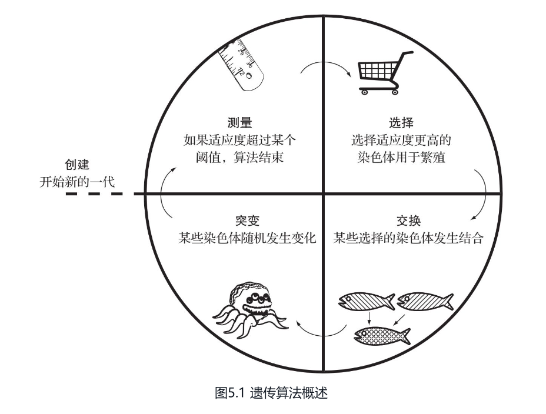

# 算法精粹-经典计算机科学问题的Java实现

## 第 1 章  一些小问题

1. 通过从头开始解决每一个问题，你将会了解那些流行的库在幕后是如何工作的。
2. 斐波那契数列是一组数字，除了第一个和第二个数字外，其他数字都是前两个数字之和：  
    0, 1, 1, 2, 3, 5, 8, 13, 21, ……  
    fib(n) = fib(n − 1) + fib(n − 2)
3. 避免无限递归由程序员负责，而不由编译器或解释器负责。  
    出现无限递归的原因是尚未指定基线条件（base case）  
    在递归函数中，基线条件是指停止递归的条件。
4. 结果缓存（memoization）是一种缓存技术，即在每次计算任务完成后就把结果保存起来，这样在下次需要时即可直接检索出结果，而不需要一而再、再而三地重复计算。
5. 递归是反向求解，而迭代是正向求解。  
    有时递归是解决问题最直观的方法。然而，直观的递归解决方案也会带来巨大的性能成本。  
    请记住，任何可以使用递归解决的问题也可以使用迭代来解决。
6. 使用生成器模式很容易就能把fib4()转换为Java流。  
    当生成器执行迭代时，每次迭代都会使用返回下一个数字的lambda函数从斐波那契数列中生成一个值。
7. 无论是在虚拟世界还是现实环境，节省空间都十分重要。空间占用越少，利用率就越高，也会更节省成本。
8. 压缩就是读取数据并对其进行编码（修改格式）的操作，以便减少数据占用的空间。解压缩则是反向的过程，即将数据恢复到原始格式。
9. Java标准库包含一个现成的结构，可用于处理任意长度的位串，称为 BitSet  
    在BitSet类中，布尔值true和false分别表示 1 和 0
10. Java字符串可被视为UTF-16字符序列。  
    每个UTF-16字符是16位的并且可以进一步细分为2个字节（每个字节8位）。  
    可以通过getBytes()方法将String转换为字节数组。  
    同样，可以使用String类型自带的构造函数将字节数组转换回String
11. 如果使用XOR合并两个数的二进制位，那么把结果数与其中某个操作数重新合并即可生成另一个操作数，这是一个很有用的特性。

    ```text
        A ^ B = C
        C ^ B = A
        C ^ A = B
    ```

## 第 2 章  搜索问题

1. 被声明为static的内部类在实例化的时候不需要考虑其外部类（你不需要为了创建一个static的内部类的实例而事先对外部类进行实例化），但这种内部类不能引用其外部类的实例变量。  
    这对于定义内部类是出于代码组织结构的目的而非代码逻辑的目的来说是有意义的。
2. 线性搜索按照原始数据结构的元素顺序来遍历搜索空间中的每个元素，直到找到要搜索的内容或达到数据结构的末尾。  
    实际上，线性搜索是最简单、自然、明显的搜索方式。  
    在最坏的情况下，线性搜索需要遍历数据结构中的每个元素，因此它的复杂度为O(n)，其中n是数据结构中的元素数。
3. 二分搜索的工作原理是，找到已排好序的所有元素中的中间元素，将其与想要查找的元素进行比较，根据比较的结果将搜索范围缩小一半，然后再重新开始这一过程。  
    二分搜索的搜索范围每次都会减小一半，所以在最坏情况下它的运行时间为O(lgn)。
4. 即使最好的排序算法也需要花费O(nlgn)的时间才能完成。  
    如果我们打算只搜索一次，并且原始数据结构未经排序，那么使用线性搜索可能是比较合理的。  
    但是如果要搜索多次的话，那么花费时间来进行排序是值得的，因为每次搜索都可以节省大量时间。
5. 深度优先搜索(Depth-First Search, DFS)顾名思义就是尽可能地往路径深处进行搜索，如果遇到了死胡同，则回溯到最后一次做出决策的那个位置。  
    或许你会注意到，使用深度优先搜索解得的迷宫路径看起来似乎有些别扭，并且通常不是最短路径。

    ```text
        1、深度优先搜索需要使用两种数据结构来记录状态：用栈来记录当前要搜索的状态，也就是位置，命名为frontier；用集合来记录已经搜索过的状态，命名为explored
        2、只要frontier中还有状态需要访问，DFS就将持续检查这些状态是不是终点状态，如果是终点状态，则停止搜索并将终点状态返回；如果不是，则将在该状态之后可以继续访问的那些状态successors添加到frontier中。
        3、为了避免原地打转，需要将已经搜索过的状态添加到explored中，防止重复访问之前已经访问过的状态。
        4、如果frontier为空，则意味着已经没有可以搜索的地方了。
        5、如果dfs()执行成功，将会返回封装了目标状态的Node。从该Node开始，利用parent属性向前遍历，即可重现由起点到目标点的路径。
    ```

6. 广度优先搜索(Breadth-First Search, BFS)找到的路径总是最短的。  
    它在每次迭代中都会从起始状态开始由近至远地搜索每一层级的所有节点。  
    在某些特定的问题中，深度优先搜索可能比广度优先搜索更快地找到解，反之亦然。  
    因此，需要在快速求解和找到最短路径（如果存在最短路径）之间进行权衡，然后决定最终选择哪种搜索方式。
7. `A*`搜索使用了成本函数和启发函数的组合，将搜索聚焦在最有可能快速抵达目标的路径上。

    ```text
        1、成本函数g(n)会检查到达指定状态的成本。
            在求解迷宫的场景中，成本是指在到达当前状态时，已经走过了多少个单元格。
        2、启发函数h(n)则给出了从当前状态到达目标状态的成本估算。
            可以证明，如果h(n)是一个可接受的启发式信息(admissible heuristic)，那么找到的最终路径将是最优解。
            可接受的启发式信息永远不会高估抵达目标的成本。理想的启发式信息能够尽可能地接近真实距离而不会过分高估。
            追求更短距离的启发式信息最终会导致搜索更多的状态，而追求接近实际距离（但不会高估以免不可接受）的启发式信息搜索的状态会比较少。
            在二维平面上，直线距离启发式信息就是一个很好的例子，因为直线总是最短路径。
            迷宫中任意两点间的曼哈顿距离比欧氏距离更接近真实距离。
            对于这种每次只能向四个方向之一移动的迷宫来说，曼哈顿距离永远不会高估距离，因此得到的解依然是最优的。
        3、到达任一状态所需的总成本为f(n)，它是g(n)与h(n)之和，即 f(n) = g(n)+h(n)
            当从frontier选取要探索的下一个状态时，A*搜索会选择f(n)最小的那个状态。
            为了能够在frontier上选出f(n)最小的那个状态，A*搜索使用优先队列(priority queue)这种数据结构来存储frontier
        4、使用启发函数后，如果启发计算结果不一致，则某些节点可能会被访问两次。
            如果在新的方向上找到节点的成本比按之前的路径访问的成本要低，则采用新的路径。
        5、A*搜索是使用最为广泛的路径搜索算法之一，只有那些对搜索空间进行预计算的算法才能打败它。
        6、在盲搜情况下，A*搜索还未尝败绩。这使得它无论在路径规划中还是在查找解析编程语言的最短路径中，都成为一种必备组件。
        7、大多数导航类地图软件（如谷歌地图）都使用Dijkstra算法（A*是其变体）进行导航。
    ```

8. 优先队列能使其数据元素维持某种内部顺序，使得首先弹出的元素始终是优先级最高的元素。  
    通常会在其内部使用二叉堆，使得入队和出队的算法复杂度均为O(lgn)
9. DFS和BFS适用于那些不太关心性能的小型数据集和状态空间。  
    在某些情况下，DFS的性能会优于BFS，但BFS总是可以得出最佳路径。  
    BFS与DFS的实现代码几乎是一样的，除了使用队列来代替栈。  
    稍微复杂的`A*`搜索可以与高质量、一致的可接受的启发式信息相结合，不仅可以得出最佳路径，而且性能也远远优于BFS  
    更为复杂的算法往往会基于广度优先搜索和深度优先搜索，如一致代价(uniform-cost)搜索和回溯搜索。  
    广度优先搜索通常足以应付在小规模图中查找最短路径的情形，然而又因为它与`A*`非常相似，所以如果大规模图具备良好的启发式信息，则能很容易地切换到`A*`

## 第 3 章  约束满足问题

1. 很多要用计算工具来解决的问题基本都可以归类为约束满足问题(Constraint-Satisfaction Problem, CSP)  
    CSP由一组变量构成，变量可能的取值范围被称为值域(domain)。要求解约束满足问题需要满足变量之间的约束。
2. 诸如Prolog和Picat这样的编程语言已经内置了用来解决约束满足问题的工具。而其他编程语言中常用的手段是构建一个由回溯搜索和几种启发式信息组合而成的框架。  
    Java的约束编程框架有 OR-Tools 和 choco-solver 等。
3. 约束满足问题框架的核心是CSP类。CSP类中包含了变量、值域和约束。  
    所有的约束都会被定义成Constraint类的子类。  
    每个Constraint包含它所约束的variables和用来检查是否满足条件的satisfied()方法。确定是否满足约束是定义某个约束满足问题所需的主要逻辑。  
    该约束满足问题框架使用简单的回溯搜索来寻找问题的解。回溯的思路如下：在搜索中一旦碰到障碍，就回到碰到障碍之前最后一次做出判断的已知点，然后选择另一条路径。
4. 约束传播(constraint propagation)是比回溯更新的一种技术，也是实际应用中的一种高效方法。

## 第 4 章  图问题

1. 图(graph)是一种抽象的数据结构，它通过将问题划分为一组相互连接的节点来对实际问题进行建模。每个节点被称为顶点(vertex)，节点之间的连线被称为边(edge)。
2. 图的数据结构可以有多种实现方式，最常见的两种是使用顶点矩阵和邻接表。  
    在顶点矩阵中，每个元素表示图中两个顶点是否相连，元素值表示顶点间的连通度（或无连接）。  
    在邻接表中，每个顶点都有一个与其相连接的顶点的列表。
3. 在图论中，连接两个顶点的所有边的集合被称为路径(path)。也就是说，路径是从一个顶点到另一个顶点的行进路线。  
    广度优先搜索可以在无权图中找到任意两个顶点之间的最短路径。
4. 树是一种特殊的图，树中任意两个顶点之间只有一条路径，这意味着树中没有环路。  
    环路可以被看作一个循环：如果可以从一个顶点开始，在不重复经过任何边的情况下遍历整个图，最终回到开始的那个顶点，则称存在一条环路。  
    任何不是树的图都可以通过修剪边来转换成树。
5. 连通图(connected graph)是指从图中任一顶点开始都能达到其他顶点的图。
6. 生成树(spanning tree)是把图中所有顶点都连接起来的树。  
    最小生成树是以最小权重（相比其他生成树而言）把加权图的每个顶点连接起来的树。  
    对于每个加权图，我们都能高效地找到其最小生成树。
7. 查找最小生成树的Jarník算法（也被称为Prim算法）把图分成两部分：正在生成的最小生成树的顶点和尚未加入最小生成树的顶点。  
    Jarník算法不一定能在有向图中正常工作，它也不适用于非连通图。  
    Jarník算法总是选择权重最小的边，所以被视为一种贪心算法。  
    除非图是非连通的，否则顶点的访问顺序并不重要。  
    如果图是非连通的，即由多个不相连的部分组成，则mst()返回一个起始顶点所属的特定部分的图。

    Jarník算法的步骤如下：

    ```text
        1.选择将要放置于最小生成树中的任一顶点。
        2.找到连通最小生成树与尚未加入树的顶点的权重最小的边。
        3.将权重最小的边的末端顶点添加到最小生成树中。
        4.重复第2、3步，直到图中所有顶点都放置于最小生成树中。
    ```

8. 计算从一个起点城市到另一个城市的成本属于“单源最短路径”问题。  
    此问题可以描述为：在加权图中，从某个顶点到其他所有顶点的最短路径（边的总权重最小）是什么？
9. Dijkstra算法可以解决单源最短路径问题。  
    只要给定一个起始顶点，它就能返回抵达加权图中其他任一顶点的最小权重路径，同时还能返回从起始顶点到其他所有顶点的最小总权重。  
    Dijkstra算法是为正权重的图设计的。

    Dijkstra算法的步骤如下：

    ```text
        1.将起始顶点加入优先队列。
        2.从优先队列中弹出距离最近的顶点（在开始的时候，该顶点是起始顶点），我们将其称为当前顶点。
        3.逐一查看连接到当前顶点的所有相邻顶点。如果这些顶点尚未被记录过或者到达这些顶点的边是新的最短路径，就逐个记录它们与起始顶点之间的距离以及产生该距离的边，并把新顶点加入优先队列。
        4.重复第2、3步，直到优先队列为空。
        5.返回起始顶点到其他所有顶点的最短距离和路径。
    ```

## 第 5 章  遗传算法

1. 遗传算法通常用于处理无法使用简单解法来解决的复杂问题。
2. 遗传算法并不是解决所有问题的好办法。  
    它们依赖三个部分或完全随机的操作：选择、交换和突变。因此，它们可能无法在合理的时间内找到最优解。  
    对于大多数问题来说，更具确定性的算法会更有保证，但是有些问题不存在快速的确定性算法，在这种情况下，遗传算法就是一个不错的选择。
3. 遗传算法通常是高度专用的，需要针对特定应用进行调优。
4. 遗传算法的概述：

    

5. 最常见的两种遗传算法的选择方法称为轮盘式选择法(roulette-wheel selection)和锦标赛选择法(tournament selection)。  
    轮盘式选择法有时也称为适应度比例选择法(fitness proportionate selection)。轮盘式选择法让每条染色体都有机会被选中，与其适应度成正比。  
    在锦标赛选择法中，一定数量的随机染色体会互相挑战，适应度最佳的那个染色体将会被选中。
6. 通过对问题进行一些了解，第一代可以包含更接近于解的个体，而不是从纯粹随机的个体开始，这被称为播种(seeding)。
7. 遗传算法不是灵丹妙药，事实上，它们并不适合大多数问题。  
    对于任何一个存在快速确定性算法的问题，遗传算法是没有意义的。  
    它们固有的随机性使得运行时间不可预测。  
    为了解决这个问题，我们可以让它们在几代后停止，但这样就不能确定是否找到了真正的最优解。
8. 只有当你有理由相信不存在更好的解决方案，或者你正在探索未知的问题时，才应该选择遗传算法。
9. 遗传算法的另一个问题是如何用染色体来表示一个问题的潜在解决方案。  
    传统的做法是将大多数问题表示为二进制字符串（即二进制位1和0的序列）。在空间使用方面，这通常是最优的，而且它还有助于实现简单的crossover函数。  
    但是大多数复杂的问题都不容易表示为可分割的位串。
10. 对于大多数规模庞大到有理由采用遗传算法的问题，遗传算法均不能保证在可预测的时间内发现最优解。  
    因此，在不需要最优解而需要“足够好”的解的情况下，可以使用它们。  
    它们很容易实现，但是调整它们的可配置参数可能需要大量的反复试验。
11. 遗传算法的一个优点是易于并行化。最明显的形式是，可以在单独的处理器上模拟每个种群。
