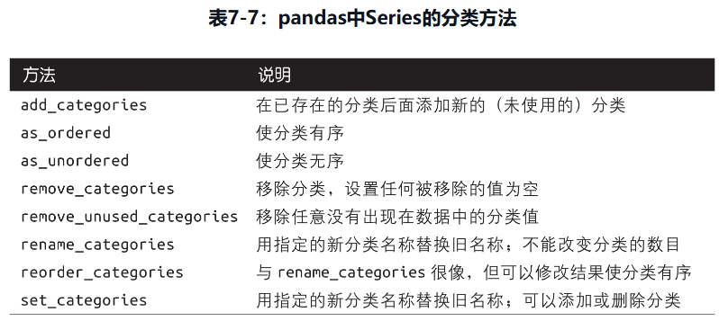

# 利用Python进行数据分析（第3版）

## 第 1 章  准备工作

1. 大部分数据集都能被转化为更加适合分析和建模的结构化形式，虽然有时这并不是很明显。如果不行的话，也可以将数据集的特征提取为某种结构化形式。
2. 大多数软件都是由两部分代码组成的，一小部分需要占用大部分执行时间的代码，以及大部分不经常执行的“胶水代码”。  
    在许多情况下，胶水代码的执行时间都是微不足道的。开发人员的精力几乎都花在优化计算瓶颈上，有时更需要转换为底层的语言（比如C语言）。
3. 对于高并发、多线程的应用程序，尤其是拥有许多计算密集型线程的应用程序而言，Python并不是一种理想的编程语言。
4. 除了为Python提供快速的数组处理能力外，NumPy在数据分析方面还有另外一个主要作用，即作为在算法和库之间传递数据的容器。
5. 对于数值型数据，NumPy数组在存储和处理数据时要比内置的Python数据结构高效得多。
6. 许多Python的数值计算工具要么使用NumPy数组作为主要的数据结构，要么可以与NumPy进行无缝交互操作。
7. 本书中应用最多的pandas对象是DataFrame，这是面向列的表格型数据结构，既有行标签也有列标签。另一个数据结构是Series，它是一维的标签化数组对象。
8. pandas兼具NumPy的高性能数组计算能力以及表格和关系型数据库（例如SQL）的灵活数据操作功能。  
    它提供了便捷的索引功能，可以完成重塑、切片、切块、连接和选取数据子集等操作。
9. pandas的许多特点通常和R语言的核心实现或扩展包保持一致。
10. 有两种安装包的方式：conda install和pip install。  
    当使用Miniconda时需要优先使用conda install，但有些包通过conda安装不上，如果conda install $package_name安装失败，可以尝试pip install $package_name。  
    建议读者首选使用conda做包管理，如果碰到无法用conda install安装的包，再使用pip。

## 第 2 章  Python语法基础、IPython和Jupyter notebook

1. 在默认情况下，IPython会隐藏以下划线开头的方法和属性，比如魔术方法和内部的“私有”方法和属性，以避免混乱显示（迷惑新人）。
2. Python语言的一个重要特性就是对象模型的一致性。  
    Python解释器中的每个数字、字符串、数据结构、函数、类、模块等，都在它的自有“盒子”内，这就是Python对象。  
    每个对象都有关联的类型（例如字符串或函数）和内部数据。  
    在实际中，这可以让语言非常灵活，因为函数也可以作为对象使用。
3. 理解Python引用的语义机制（即数据是何时、如何、为何复制的）是非常重要的。尤其是当你用Python处理大数据集时。
4. Python中的对象不涉及固有类型，通过引用，变量可以引用不同类型的对象。
5. 我们认为Python是强类型语言，这意味着每个对象都有显式指定的类型（或类），隐式转换只在特定的情况下发生。  
    在Python中不允许以下隐式转换： '5' + 5
6. isinstance可以接收包含类型的元组作为参数，检查对象类型是否在类型元组中。
7. 要判断两个变量是否引用同一个对象，可以使用is关键字；is not可以判断两个对象是不同的。  
    is和is not常用来判断变量是否为None，因为None的实例是唯一的：
8. 请牢记，可以修改对象并不意味着必须修改它。修改通常会带来副作用。
9. 字符串是Unicode字符的序列，因此可以像其他序列一样处理。
10. 虽然range可以生成任意大的序列，但它在任意时刻耗用的内存却很小。

## 第 3 章  Python语法基础、IPython和Jupyter notebook

1. 元组是一个长度固定且不可变的Python序列对象，一旦赋值就不能修改。  
    创建元组最简单的方式是用逗号分隔序列值。  
    用tuple方法可以将任意序列或迭代器转换成元组。  
    元组中存储的对象可能是可变对象。  
    可以用加号将元组串联起来，形成更长的元组。  
    与列表一样，元组乘以一个整数会将几个元组复制并串联起来。  
    在某些情况下，你可能想从元组的开头“摘取”几个元素。使用特殊的语法＊rest可以实现该功能，它也用在函数签名中以获取任意长度的位置参数列表。  
    作为惯用写法，许多Python程序员会使用下划线(_)表示不需要的变量。  
    因为不能修改元组的大小和内容，所以它的实例方法都很轻量。  
    其中一个很有用的方法是count（也适用于列表），用于统计某个值出现的频次。
2. 与元组相比，列表是可变对象，长度可变，内容可以就地修改。  
    与append相比，insert耗费的计算量更大，因为对后续元素的引用必须在内部迁移，以便为新元素提供空间。  
    如果要在序列的头部和尾部插入元素，可能需要使用collections.deque，这是一个双端队列，是Python标准库中专门为此目的而优化实现的库。  
    insert的逆运算是pop，它移除并返回指定索引位置的元素。  
    可以用remove去除某个值，remove会寻找首先出现的值并去除它。  
    用in关键字可以检查列表是否包含某个值。  
    在列表中检查是否存在某个值远比在字典和集合中检查速度慢，因为Python是线性扫描列表中的值，但在字典和集合中，在同样的时间内还可以检查其他项（基于散列表）。  
    通过加法串联列表的计算量较大，这是由于要新建一个列表，并且要复制对象。用extend追加元素，尤其是创建大列表时，更为可取。  
    sort有一些选项，有时会很好用。其中之一是传递一个二级排序键(sort key)，即一个用于生成排序值的函数。  
    切片包含start索引的元素，但不包含end索引的元素。因此，切片结果中包含的元素个数是stop-start。
3. 在其他编程语言中，字典可能称为散列表(hash map)或关联数组(associative array)。  
    可以用del关键字或pop方法（返回值的同时删除键）删除值。  
    可以用update方法将一个字典与另一个字典合并。  
    update方法是就地修改字典，因此任何传递给update的键的旧值都会被舍弃。  
    因为字典本质上是二元组的集合，dict函数可以接收二元组的列表。  
    可以用hash函数检查对象是不是可散列化的（即可用作字典的键）。
4. 集合是唯一元素的无序集合。  
    可以用两种方式创建集合：通过set函数或使用大括号的集合字面量(set literal)。  
    集合支持并集、交集、差集和对称差集等数学集合运算。  
    如果将不是集合的输入传递给union和intersection等方法，则Python会在执行操作之前将输入转换为集合。  
    如果使用的是二元运算符，运算符前后的两个对象都必须是集合。  
    与字典类似，集合元素通常都是不可变的，必须是可散列的，即对值调用hash方法不抛出异常。  
    要想在集合中存储列表型的元素（或其他可变序列），必须先转换成元组。  
    只有当集合的内容相同时（不考虑顺序），两个集合才相等。
5. 内置的序列函数：  
    Python内置了一个enumerate函数，可以返回(i, value)元组序列。  
    zip的常见用法是同时迭代多个序列，有时会和enumerate同时使用。  
    reversed是一个生成器，只有实例化（例如使用list函数或for循环）之后才能创建倒序的序列。
6. 列表推导式可以有任意多级的嵌套，但是如果有两三级以上的嵌套，就应该从代码可读性的角度考虑一下了。  
    嵌套列表推导式要和列表推导式中的列表推导式区分开，后者也是非常有效的。
7. 作为最重要的原则，如果你要重复使用相同或非常类似的代码，就需要写一个函数。
8. 如果Python到达函数末尾时没有遇到任何一条return语句，则自动返回None 。
9. 局部命名空间是在函数被调用时创建的，函数参数会立即填入该命名空间。  
    在函数执行完毕之后，局部命名空间就会被销毁（存在一些例外情况）。
10. 通常不建议频繁使用global关键字，因为全局变量一般用于存放系统的某些状态。
11. 这种更加函数化的模式使你能在更高的层次轻松修改字符串的转换方式。此时的函数clean_strings也更具可复用性和通用性。  
    还可以将函数用作其他函数的参数，比如内置的map函数可以将函数应用到序列上。

    ```python

        import re

        def remove_punctuation(value):
            return re.sub("[!#?]", "", value)

        clean_ops = [str.strip, remove_punctuation, str.title]

        def clean_strings(strings, ops):
            result = []

            for value in strings:
                for func in ops:
                    value = func(value)

                result.append(value)

            return result
    ```

12. Python支持所谓的匿名(anonymous)或lambda函数。  
    匿名函数仅由单条语句组成，其结果就是返回值。
13. 当你编写for key in some_dict时，Python解释器首先会尝试从some_dict创建一个迭代器。  
    迭代器也是对象，它可以在诸如for循环的场景中为Python解释器生成对象。
14. 要创建生成器，只需将函数中的return替换为yeild关键字即可。  
    因为生成器每次只输出一个元素，而不是一次性输出整个列表，所以生成器可以让程序占用更少的内存。  
    标准库itertools模块中有一组用于许多常见数据算法的生成器。
15. 可以用异常类型元组同时捕获多个异常（必须使用圆括号）。
16. 自身拥有额外的上下文是IPython相对于Python标准解释器的极大优势（后者不附带任何上下文）。
17. 为了维持跨平台统一性，最好在打开文件时传入编码（例如使用最广泛的encoding="utf-8"）。  
    因为对于不同的平台，读取文件时默认的Unicode编码不同。
18. 从文件中取出的行都带有完整的行终止符(End-Of-Line，EOL)，因此你常会看到使用代码得到一组没有EOL的行的列表。
19. 如果你经常对非ASCII字符文本进行数据分析，则通晓Python的Unicode功能是非常重要的。

## 第 4 章  NumPy基础：数组和向量化计算

1. NumPy对于数值计算特别重要的原因之一，是它被设计为可以高效处理大型数组的数据。

    ```text
        NumPy是在一个连续的内存块中存储数据，独立于其他Python内置对象。
        比起Python的内置序列，NumPy数组使用的内存更少。
        NumPy的核心特点之一就是其N维数组对象，即ndarray，该对象是一个快速且灵活的Python大数据集容器。
        ndarray是通用的同构数据多维容器，同构数据是指其中所有元素必须是相同类型的。
        每个数组都有一个shape（用于表示各维度大小的元组）和一个dtype（用于说明数组的数据类型）。
        数据类型(dtype)是一个特殊对象，它包含ndarray所需的将一块内存解释为特定数据类型的信息（或元数据，即关于数据的数据）。
        创建数组最简单的办法是使用array函数。它接收任意序列型的对象（包括其他数组），然后生成一个新的包含传入数据的NumPy数组。
        由于NumPy专注于数值计算，因此如果没有特别指明，数据类型在大多数场景中都是float64（浮点数）。
        NumPy的C语言编写的算法库可以操作内存，而不必进行类型检查或其他前期工作。
        NumPy之所以比常规的Python代码快，是因为NumPy的基于C语言的算法无须对Python代码进行解释，节省了开销。
        由于NumPy提供了一套功能强大、文档翔实的C语言API，因此很容易将数据传递给由底层语言编写的外部库，外部库也能以NumPy数组的形式将数据返回给Python。
        数据类型是NumPy能与其他系统灵活交互数据的来源。通常，数据类型提供了直接映射到底层硬盘或内存的表征，这使得“读写磁盘上的二进制数据流”以及“集成底层语言代码（如C、Fortran）”等工作变得更加简单。
    ```

2. numpy的通用函数：

    ```text
        numpy.zeros和numpy.ones分别可以创建指定长度或形状的全0和全1数组。
        numpy.empty可以创建一个没有任何具体值的数组。要用这些方法创建多维数组，只需传入一个表示形状的元组即可。
            使用numpy.empty创建全0数组的做法并不妥当。它返回的是未初始化的内存值，可能包含非0的“垃圾”值。只有当你给新数组填充数据时，才应该使用这个函数。
        numpy.arange是Python内置的range函数的数组版。
        numpy.random模块对Python内置的random模块补充了一些函数，用于从多种概率分布中有效地生成整个样本值数组。
        通过ndarray的astype方法可以将数组从一种数据类型转换或投射成另一种数据类型。
            如果转换过程由于某种原因而失败了（比如某个字符串不能转换为float64），就会抛出ValueError异常。
            即使新的数据类型与旧的数据类型相同，调用astype也总会创建一个新的数组（一个数据的备份）。
        使用numpy.string_类型时，一定要小心，因为NumPy的字符串数据是大小固定的，发生截断时不会发出警告。
        numpy.where函数是三元表达式x if condition else y的向量化版本。
        顶级方法numpy.sort返回的是已排序数组的副本（类似于Python的内置函数sorted），而不是就地修改数组。
        numpy.save和numpy.load是读写磁盘数组数据的两个主要函数。
    ```

3. 数组很重要，因为它不用编写循环即可对数据执行批量运算，NumPy用户称其为向量化(vectorization)。  
    NumPy数组使你可以将许多种数据处理任务表述为简洁的数组表达式，而无须编写循环。用数组表达式代替循环的做法通常称为向量化。  
    NumPy可以在整个数组上执行复杂的运算，而不需要Python的for循环，for循环对于大型序列速度较慢。  
    一般来说，向量化数组运算要比等价的纯Python方式快得多，尤其是各种数值计算。  
    大小相等的数组之间的任何算术运算都会将运算应用到元素级。  
    当你将一个标量值赋值给一个切片时，如arr[5:8]=12，该值会自动传播或广播到整个切片。
4. 与列表最重要的区别在于，数组切片是原始数组的视图。这意味着数据不会被复制，视图上的任何修改都会直接反映到源数组上。  
    由于NumPy的设计目的是处理大型数组，所以可以想象一下，假如NumPy坚持要将数据复制来复制去的话会产生何等的性能和内存问题。
5. 通过布尔型索引选取数组中的数据，并给结果赋值新的变量，将总是创建数据的副本，即使返回一模一样的数组也是如此。  
    Python关键字and和or不能用于布尔型数组，要使用&（与）和|（或）。
6. 转置是重塑的特殊形式，它返回的是源数据的视图，不会进行任何复制操作。  
    数组不仅有transpose方法，还有一个特殊的T属性。
7. NumPy提供了一个用于矩阵乘法的dot函数，它既是数组方法也是numpy命名空间中的函数：  
    x.dot(y)等价于np.dot(x, y) ；  
    另一种做矩阵乘法的方式是使用 @ 中缀运算符。

## 第 5 章  pandas入门

1. 虽然pandas采用了大量的NumPy编码风格，但二者最大的不同是，pandas是专门为处理表格和异构数据设计的，而NumPy更适合处理同构类型的数值数组数据。
2. pandas的导入惯例：

    ```python
        import numpy as np
        import pandas as pd
        from pandas import Series, DataFrame
    ```

3. 要使用pandas，需要熟悉它的两个主要数据结构：Series和DataFrame 。
4. Series是一种类似于一维数组的对象，它由一组数据以及一组与之相关的数据标签（即索引）组成。

    ```text
        Series以交互式的方式呈现，索引位于左边，值位于右边。
        没有指定索引时会自动创建一个从0开始的整数型索引。
        array和index属性分别获取其数组值和索引对象。
        可以通过索引的标签选取Series中的单个或一组值。
        对Series进行的运算都会保留索引值的链接。
        pandas的isnull和notnull函数可用于检测缺失数据。
        Series对象本身及其索引都有name属性，该属性与pandas其他功能的关系非常密切。
        Series的索引可以通过赋值的方式就地修改。
        Series和字典的转换：
            可以将Series看作长度固定的有序字典，因为它是索引值对数据值的映射。在可能使用字典的场景中，也可以使用Series。
            如果数据已经存放在一个Python字典中，也可以通过传入这个字典来创建Series。
            如果只传入一个字典，则结果Series中的索引会遵循字典的键的顺序，而键的顺序依据的是字典的keys方法，keys方法又取决于键的插入顺序。
            你可以将字典键按照想要的顺序传给构造函数，从而使生成的Series的索引顺序符合你的预期。
            通过to_dict方法，Series也可以转换回字典。
    ```

5. DataFrame是矩形的数据表，它含有一组有序且有命名的列，每一列可以是不同的数据类型（数值、字符串、布尔值等）。  
    DataFrame既有行索引也有列索引，可以看作由共用同一个索引的Series组成的字典。

    ```text
        虽然DataFrame是二维的，但利用层次化索引，你仍然可以用其表示更高维度的表格型数据。
        创建DataFrame最常用的方式是传入一个由等长列表或NumPy数组构成的字典。
        如果指定了列的序列，则DataFrame的列就会按照指定顺序进行排列。
        如果字典不包含传入的列，就会在结果中产生缺失值。
        通过类似字典标记的方式或点属性的方式，可以将DataFrame的列获取为一个Series。
            返回的Series拥有与原DataFrame相同的索引，且其name属性也已经合理地设置好了。
            frame[column]适用于任意列的名，但是frame.column只有在列名是合理的Python变量名时才适用，并且不能与任意的DataFrame的方法名冲突。
                例如，如果列名包含空格或下划线以外的符号，就不能用点属性的方式访问。
        将列表或数组赋值给某个列时，其长度必须跟DataFrame的长度相匹配。
            如果赋值的是一个Series，它的标签就会精确匹配DataFrame的索引，所有的空缺都将填上缺失值。
        为不存在的列赋值会创建一个新的列。
        关键字del可以像在字典中那样删除列。
        通过索引方式从DataFrame返回的列只是底层数据的视图而已，并不是副本。
            对返回的Series所做的任何就地修改全都会反映到DataFrame上。
        应当通过Series的copy方法来复制列。
        如果将嵌套字典传给DataFrame，pandas就会将外层字典的键解释为列，将内层字典的键解释为行索引。
        使用类似NumPy数组的方法，可以对DataFrame进行转置（交换行和列）。
            如果列没有所有相同的数据类型，转置则会丢弃列的数据类型，因此转置以及再次转置返回原先的矩阵会导致丢失先前的类型信息。
        如果设置了DataFrame的index和columns的name属性，则这些信息也会显示出来。
            不同于Series，DataFrame本身没有name属性。
        DataFrame的to_numpy方法将数据以二维ndarray的DataFrame形式返回。
        如果DataFrame各列的数据类型不同，则返回数组会选用能兼容所有列的数据类型。
    ```

6. 索引对象：

    ```text
        pandas的索引对象负责存储轴标签（包括DataFrame的列名）和其他元数据（比如轴名称或标签）。
        构建Series或DataFrame时，所用到的任何数组或其他标签序列都会转换成索引对象。
        Index对象是不可变的，因此用户不能对其进行修改。不可变性可以使索引对象在多个数据结构之间安全共享。
        每个索引都有一些集合逻辑的方法和属性，可用于处理索引所包含数据的常见问题。
        虽然许多pandas函数（如reindex）都要求标签唯一，但这并不是强制性的。
            索引的is_unique属性可以告诉我们索引值是不是唯一的。
            对于带有重复值的索引，数据选取操作将会有些不同。
                如果某个标签对应多个项，则返回Series；如果对应单个项，则返回标量值。
                这样会使代码变复杂，因为索引的输出类型会根据标签是不是重复的而发生变化。
        pandas对象的一个重要方法是reindex，其作用是创建一个数据根据新索引重新排列的新对象。
            对该Series调用reindex将会根据新索引进行重排。如果某个索引值当前不存在，就导入缺失值。
            对于时间序列这样的有序数据，重建索引时可能需要做一些插值或填值处理。method选项可以达到此目的。
            对于DataFrame，只传入一个序列时，reindex默认会重建索引结果中的行。可以用columns关键字指定重建列索引。也可以同时修改行索引和列索引。 
            对Series和DataFrame重建索引时，也可以用fill_value指定不同的填充值。
            另一种重建索引的方式是传入新的轴标签作为位置参数，然后用axis关键字对指定轴进行重建索引。
            还可以用loc运算符重建索引，这也是多数人更为常用的方式。
                只有当新索引的标签在DataFrame中已经存在时，才能这么做，否则的话，reindex将会给新标签插入缺失值。
    ```

7. 删除指定轴上的项：

    ```text
        删除某条轴上的一个或多个项很简单，只要有一个索引数组或不包含这些项的列表，就可以使用reindex方法或基于.loc的索引进行删除。
        drop方法返回在指定轴上删除了指定值的新对象。
            用标签序列调用drop会从行标签(axis 0)删除值。
            通过传入columns关键字，可以删除列的标签。
            还可以传入 axis=1 或 axis="columns" 从列删除值。
    ```

8. 索引、选取和过滤

    ```text
        用[]进行索引时，针对整数的处理有所不同。
            如果索引包含整数，常规的基于[]的索引会将整数用作标签，因此索引的选取取决于数据类型。
        方括号不仅用于切片索引，还用于对DataFrame的多个轴进行索引。
        为了避免错误，最好使用loc和iloc来选取数据。
            loc运算符只使用标签，iloc运算符只使用整数。
                无论索引是否包含整数，都能使用iloc 。
                像函数那样调用loc和iloc是新手常犯的错误，正确的方式是用方括号进行索引。
                可以使用轴标签(loc)或整数(iloc)从DataFrame选取行和列的子集。
            loc和iloc除了单个标签或多个标签，这两个索引函数也可以使用切片。
                loc的切片是包含末端的。
            loc可以使用布尔型数组，但iloc不能使用。
            这两个索引属性可就地修改DataFrame，需要谨慎操作。
        首要的原则是在赋值时避免链式索引。
            链式选取可能抛出SettingWithCopyWarning，这是警告用户正在修改临时值，而非修改原始数据，后者才是本来想修改的。
    ```

9. 算术运算和数据对齐

    ```text
        如果存在不同的索引对，则结果中的索引是所有索引的并集。
            对于不重叠的标签，内部数据对齐会导入缺失值。缺失值会在以后的算术运算过程中传播。
            对于DataFrame，对齐操作会同时发生在行和列上。
            如果将没有共用的列或行标签的DataFrame对象相加，结果将全部为空。
        使用add方法传入fill_value参数，可以替换运算中的缺失值。
        每个方法都有一个以字母r开头的副本，会将参数翻转。
        默认情况下，DataFrame和Series之间的算术运算会将Series的索引匹配到DataFrame的列，然后沿着行一直向下广播。
            当我们从DataFrame减去Series时，每一行都会执行这个操作。
            如果某个索引值在DataFrame的列或Series的索引中找不到，则参与运算的两个对象就会重建索引以形成并集。
            如果你希望在列上广播且匹配行，则必须使用算术运算方法并指定匹配索引。
    ```

10. 函数应用和映射

    ```text
        NumPy的通用函数（元素级数组方法）也可用于操作pandas对象。
        DataFrame的apply方法可以将函数应用到由各列或各行所形成的一维数组上。
            传递到apply的函数不一定返回单个标量值，还可以返回由多个值组成的Series 。
            如果传递 axis="columns" 给apply函数，这个函数会在每行执行一次，可以将其当作“跨列处理”。
        许多最为常见的数组统计功能（如sum和mean）都是DataFrame的方法，因此无须使用apply方法。
        还可以使用元素级的Python函数。
            假如你想得到frame中各个浮点值的格式化字符串，使用applymap即可。
            之所以叫作applymap，是因为Series有一个用于元素级函数的map方法。
    ```

11. 排序和排名

    ```text
        sort_index方法可以对行或列标签按字典顺序排序，它将返回一个排好序的新对象。
            对于DataFrame，可以根据任意一个轴上的索引进行排序。
            数据默认是按升序排序的，但也可以降序排序。
        sort_values方法可按值进行排序。
            当对DataFrame排序时，可以使用一列或多列中的数据作为排序键。要根据多个列进行排序，传入列名的列表即可。
            在排序时，任何缺失值默认都会放到末尾。使用na_position选项可以将缺失值排在最前面。
            排名从数组中的最小值开始，从1一直到数组中有效数据的数量。
        默认情况下，rank是通过“为各组分配平均排名”的方式破坏平级关系的。
            也可以根据值在原数据中出现的顺序给出排名。
    ```

12. 常用的数学和统计方法

    ```text
        约简或汇总统计用于从Series中提取单个值（如sum或mean）或从DataFrame的行或列中提取Series。
            与对应的NumPy数组方法相比，它们都内置有处理缺失数据的功能。
                如果某行或某列全为NA值，则和为0 。
                但如果既有NA值也有非NA值，则会自动跳过NA值。
                如果不想跳过，可以通过skipna选项设置。如果某行或某列有NA值，则结果就是NA值。
            有些方法（如idxmin和idxmax）返回的是间接统计，比如达到最小值或最大值的索引。
            Series的corr方法用于计算两个Series中重叠的、非NA的、按索引对齐的值的相关系数。
                cov用于计算协方差。
            DataFrame的corr和cov方法将以DataFrame的形式分别返回完整的相关系数和协方差矩阵。
            利用DataFrame的corrwith方法，可以计算一个DataFrame中列或行与另一个Series或DataFrame之间的相关系数。
                传入axis="columns"即可按行进行计算。
            无论哪种情况，在计算相关系数之前，所有的数据项都会按标签对齐。
            unique用于生成Series中的唯一值的数组。
                返回的唯一值不一定是排好序的，如果需要的话，可以对结果再次进行排序（使用uniques.sort()）。
            value_counts用于计算Series中各值出现的频次。
                结果Series是按频次降序排列的。value_counts是顶级的pandas方法，可用于NumPy数组或其他Python序列。
            与isin相关的是Index.get_indexer方法，它可以提供一个索引数组，将可能包含重复值的数组转换为唯一值的数组。
    ```

## 第 6 章  数据加载、存储与文件格式

1. pandas提供了一些用于将表格型数据读取为DataFrame对象的函数。  
    其中一些函数会进行类型推断，也就是说，无须指定列的类型到底是数值、整数、布尔值还是字符串。  
    其他的数据格式，如HDF5、ORC和Parquet，会在格式中嵌入数据类型。  
    处理日期和其他自定义类型的处理需要多花点时间。

    

2. pandas.read_csv 用于读取 CSV 格式文件，read_csv 返回 TextFileReader 类型对象。

    ```text
        在某些情况下，有些表格使用的可能不是固定的分隔符，而是用空白符或其他方式分隔字段。
            这种情况下，可以传入一个正则表达式作为分隔符(sep="\s+")。
        缺失数据经常是要么丢失（空字符串），要么用某些标记值（占位符）表示。
            默认情况下，pandas会使用常见的标识，比如NA和NULL 。
            read_csv有多种默认的NA标记值，可以用选项keep_default_na使其失效。
        要逐块读取文件，可以指定chunksize作为行数。
            TextFileReader对象可以根据chunksize对文件进行逐块迭代。
            TextFileReader还有一个get_chunk方法，用于读取任意大小的数据块。
        利用DataFrame的to_csv方法，可以将数据导出到逗号分隔的文件中。
            缺失值在输出结果中会表示为空字符串。
            如果没有设置其他选项，则会输出行和列的标签。
        定义csv.Dialect的子类可定义出新格式（如专门的分隔符、字符串引用约定、行终止符等）。
            也可以用关键字的形式将CSV格式参数提供给csv.reader，而无须定义子类。
    ```

    

3. JSON是应用程序之间交换数据的标准格式之一。

    ```text
        JSON的基本类型有对象（字典）、数组（列表）、字符串、数值、布尔值以及空值。
        对象中所有的键都必须是字符串。
        pandas.read_json可以自动将JSON数据集转换为指定形式的Series或DataFrame。
            read_json的默认选项假设JSON数组中的每个对象是表格中的一行。
            如果需要将数据从pandas输出到JSON，可以对Series和DataFrame使用to_json方法。
    ```

4. pandas有一个内置函数pandas.read_html，可以使用解析库自动将HTML文件中的表格解析为DataFrame对象。  
    read_html默认条件下会搜索、尝试解析`<table>`标签内的所有表格数据。
5. 所有pandas对象都有一个to_pickle方法，可以将数据以pickle格式保存到磁盘上。

    ```text
        pickle文件只对Python是可读的。
            通过内置的pickle可以直接读取序列化数据，或者使用更为便捷的pandas.read_pickle 。
        建议将pickle只用于短期存储格式。
            其原因是很难保证该格式永远是稳定的。
            现在序列化的对象可能无法被后续版本的库反序列化出来。
            虽然pandas尽力保证做到向后兼容，但是今后说不定还是得抛弃pickle格式。
    ```

6. 使用pandas.ExcelFile类或pandas.read_excel函数，pandas还支持读取存储于Excel 2003（以及更高版本）文件中的表格型数据。  
    在这些工具内部，它们分别使用附加组件包xlrd和openpyxl读取旧格式的XLS文件和新格式的XLSX文件。  
    如果要将pandas数据写入Excel格式，必须首先创建ExcelWriter，然后用pandas对象的to_excel方法写入。  
    如果不想使用ExcelWriter，可以将文件路径直接传递给to_excel 。
7. 对于那些大到无法放入内存的数据集，HDF5是不错的选择，因为它可以高效读写大型数组中的一小部分。

    ```text
        要使用pandas读取HDF5文件，必须首先安装pytables包。
        如果需要在本地处理海量数据，建议读者好好研究一下PyTables和h5py，看看它们是否满足你的需求。
        由于大量数据分析问题都是IO密集型（而不是CPU密集型）问题，利用HDF5这样的工具能显著提升应用程序的效率。
        HDF5不是数据库。它最适合用作“一次写多次读”的数据集。
            虽然数据可以在任何时候被添加到文件中，但如果同时发生多个写操作，文件就可能会受到破坏。
        HDFStore支持两种存储模式："fixed"和"table"（"fixed"是默认模式）。
            后者通常更慢，但支持使用特殊语法进行查询操作。
        pandas.read_hdf函数可以快捷使用这些工具。
    ```

8. pandas有一个read_sql函数，可以让你从通用的SQLAlchemy连接轻松读取数据。

## 第 7 章  数据清洗和准备

1. pandas对象的所有描述性统计默认都不包括缺失数据。

    ```text
        对于float64类型的数据，pandas使用浮点值NaN(Not a Number)表示缺失数据。
        在pandas中，我们采用了R语言中的约定，即将缺失值表示为NA，它表示不可用(Not Available)。
        对于Series，dropna返回一个仅含非空数据和索引值的Series 。
        对于DataFrame对象，dropna默认丢弃任何含有缺失值的行。
            传入how="all"将只丢弃全为NA的那些行。
            用这种方式丢弃列，需传入axis="columns" 。
        函数fillna将缺失值替换为一个常数值。
            若调用fillna时使用字典，就可以实现对不同的列填充不同的值。
        这些函数默认返回的是新对象，并不修改原始对象的内容。
    ```

2. DataFrame的duplicated方法返回一个布尔型Series，表示各行是不是重复行。  
    drop_duplicates方法用于删除DataFrame中的重复行。  
    这两个方法默认会判断全部列，也可以指定部分列判断是否重复。  
    duplicated和drop_duplicates默认保留的是第一个出现的值组合。传入keep="last"则保留最后一个。
3. 使用map能实现元素级转换以及其他的数据清洗工作。  
    replace提供了修改对象的数据子集的更简单、更灵活的方式。  
    data.replace方法与data.str.replace不同，后者做的是字符串的元素级替换。
4. 与Series中的值一样，轴标签也可以通过函数或映射进行转换，从而得到一个新的不同标签的对象。  
    还可以就地修改轴，无须新建一个数据结构。  
    如果不想修改原始数据可以使用 rename 方法。rename可以结合字典型对象实现对部分轴标签的更新。
5. pandas.cut和qcut可以实现数据分箱功能。

    ```text
        pandas.cut返回一个分类对象。分类对象的每个组都是区间值类型，包含下限值和上限值。
            圆括号表示边是开放的（不包括），而方括号则表示边是封闭的（包括）。
            哪边是封闭的可以通过right=False进行修改。
            如果传入的是分箱数量，则会根据数据的最小值和最大值计算得到等长的箱。
        pd.value_counts(categories)可以对分箱进行计数。
        pandas.qcut函数类似于pandas.cut，它可以根据样本分位数对数据进行划分。
            根据数据的分布情况，pandas.cut可能无法使各个分箱中含有相同数量的数据点。
            pandas.qcut使用的是样本分位数，因此可以得到大小基本相等的分箱。
    ```

6. any方法可以对DataFrame中的行进行过滤。  
    np.sign(data)可以根据值生成1和-1 。
7. numpy.random.permutation函数可以实现列的置换（即随机重排序）。  
    sample方法可以选取随机子集。
8. pandas.get_dummies函数可以将分类变量转换为“虚拟”或“指标矩阵”。  
    用这种方式创建多成员指标变量没有那么快。  
    最好使用更底层的函数，将其直接写入NumPy数组，然后将结果封装在DataFrame中。  
    在统计中最好是将pandas.get_dummies和pandas.cut等离散化函数结合起来使用。
9. pandas因为底层基于NumPy，所以也带来一些问题：  
    当导入缺失值时，pandas会使用np.nan来表示空值。这会带来一定的复合效应，导致许多pandas算法出现不易察觉的问题。  
    含有大量字符串数据的数据集，不仅计算开销大，还会占用很多内存。  
    某些数据类型，比如带有时区的时间区间、时间差和时间戳，如果不使用计算开销大的Python对象数组，就不能实现高效计算。
10. pandas的扩展类型可以当作NumPy数组的一级类，等同于其他NumPy原生数据。

    

11. Python内置的字符串对象方法：

    

12. 正则表达式提供了一种在文本中搜索或匹配字符串模式的方法。

    ```text
        正则表达式常称作regex，是根据正则表达式语言编写的字符串。
        Python内置的re模块负责对字符串应用正则表达式。
            re模块的函数可以分为三个大类：模式匹配、替换以及拆分。
        调用re.split("\s+", text)时，正则表达式会先被编译，然后在text上调用其split方法。
            如果打算对许多字符串应用同一条正则表达式，强烈建议通过re.compile创建正则表达式对象。
        findall方法可以得到匹配正则表达式的所有模式。
            findall返回的是字符串中所有的匹配项。
                对于带有分组的模式，findall会返回一个元组列表。
            search则只返回第一个匹配项。
            match更加严格，它只匹配字符串的起始位置。
        sub方法可以将匹配到的模式替换为指定字符串，并返回所得到的新字符串。
        groups方法返回一个由模式各段组成的元组。
    ```

    

13. 通过data.map，所有字符串和正则表达式方法都能应用于（传入lambda表达式或其他函数）各个值。  
    如果存在NA（空值）就会报错。  
    Series为字符串操作提供了一些能够跳过并传播NA值的面向数组的方法（通过str属性访问）。

    

14. 分类数据可以不是字符串，分类数组可以包括任意不可变类型。  
    在大型数据集中，分类经常作为节省内存和提高性能的快捷工具。  
    当使用统计或机器学习工具时，通常会将分类数据转换为虚拟变量，也称为独热编码。

    

## 第 8 章  数据规整：连接、联合和重塑

1. 层次化索引使你能在一个轴上拥有多个（两个以上）索引层级。  
    对于DataFrame，每个轴都可以有分层索引。  
    通过nlevels属性，可以知道索引有多少层。  
    可以单独创建MultiIndex，然后复用。
2. swaplevel方法接收两个层级编号或名称，并返回一个层级互换的新对象（但数据不会发生变化）。
3. sort_index默认根据所有索引层级中的字母顺序对数据进行排序，也可以通过传入level参数只选取单层级或层级的子集。  
    如果索引从最外层开始是按字母顺序排序的，即数据是执行了sort_index(level=0)或sort_index()之后的结果，则对数据进行选取的性能会高得多。
4. 许多对DataFrame和Series的描述性和汇总性统计都有一个level选项，用于指定在某条轴的特定层级进行聚合。
5. DataFrame的set_index函数会将单列或多列转换为行索引，并创建一个新的DataFrame 。  
    默认情况下，这些列会从DataFrame中移除，可以通过传入drop=False将其保留下来。  
    reset_index的功能与set_index相反，它将层次化索引的层级转移到列。
6. pandas主要使用merge函数对数据执行连接操作。

    ```text
        merge可根据单个或多个键将不同DataFrame中的行连接起来。
            虽然可以手工处理列名重叠的问题，但merge的suffixes选项可用于在左右两个DataFrame对象的重叠列名后指定需要添加的字符串。
            默认情况下：
                merge会将重叠的列名当作键。
                merge输出结果的列顺序是未指定的。
                merge做的是“内连接”，结果中的键是交集，或者是两张表的公共集合。
        其他连接方式还有"left"（左连接）、"right"（右连接）以及"outer"（外连接）。
            外连接取的是键的并集，融合了左连接和右连接的效果。
            在外连接中，如果左侧或右侧DataFrame对象的行与其他DataFrame中的键不匹配，则这些不匹配的行将以NA值的方式出现在其他DataFrame的列中。
        多对多的合并会生成匹配键的笛卡儿积。
        how关键字的连接方式仅影响出现在结果中的不同键值。
        要根据多个键进行合并，传入一个由列名组成的列表即可。
        结果中会出现哪些键组合取决于所选的合并方法，可以这样理解，将多个键当作元组的数组，并将元组作为单个连接键使用。
        在进行列-列连接时，会丢弃传入DataFrame对象中的索引。如果需要保留索引值，可以使用reset_index将索引追加到列。
        在某些情况下，DataFrame中的连接键位于其索引（行标签）中。
            在这种情况下，可以传入left_index=True或right_index=True（也可以两个都传）以说明将索引用作连接键。
    ```

    

7. pandas.concat沿一条轴将多个对象连接或“堆叠”到一起。

    ```text
        对于pandas对象（如Series和DataFrame），带有标签的轴使你能进一步泛化数组的拼接操作。
            许多情况下，DataFrame默认的整数标签最好在拼接时删掉。
            默认情况下，pandas.concat是在axis="index"上工作的，最终生成一个新Series 。
                如果传入axis="columns"，则结果就会变成DataFrame 。
            这种情况下，另外的轴上没有重叠，实际上就是索引的并集（即外连接）。
                传入join="inner"即可得到它们的交集。
        另一个问题是在结果中无法辨认参与拼接的数据。
            假设你想在拼接轴上创建层次化索引，可以使用参数keys来实现。
            如果沿着axis="columns"对Series进行合并，keys则会成为DataFrame的列标签。
            参数keys被用来创建层次化索引，其中的第一级可以用于判断参与拼接的DataFrame对象。
        传入ignore_index=True会丢弃原索引，只是将列数据做拼接，并赋值创建一个默认的新索引。
        NumPy的concatenate函数可以实现对NumPy数组的拼接。
    ```

    

8. combine_first将重复数据拼接在一起，用一个对象中的值填充另一个对象中的缺失值。  
    numpy.where不会检查索引标签是否对齐（也不要求两个对象具有相同的长度），所以如果想要按照索引排列值，需要使用Series的combine_first方法。  
    对于DataFrame，combine_first也会逐列做同样的操作，因此可以认为用传入对象的数据为调用对象的缺失数据“打补丁”。
9. DataFrame的join方法可用于合并多个带有相同或相似索引的DataFrame对象，但要求没有重叠的列。  
    join方法默认使用左连接。  
    join方法支持在调用的列上传入DataFrame的索引。  
    join方法将连接的数据“融入”对象。
10. 层次化索引为重排DataFrame数据提供了一种具有良好一致性的方式。

    ```text
        stack将数据的列“旋转”为行。
            对DataFrame使用stack方法即可将列透视为行，得到一个Series 。
            stack操作默认会过滤缺失数据，因此该运算是可逆的。
            调用stack时我们可以指明轴的名称。
        unstack将数据的行透视为列。
            对于一个层次化索引的Series，可以用unstack方法将其重排为DataFrame 。
            unstack默认操作的是最内层（stack也是如此）。传入层级编号或名称，即可对其他层级进行unstack操作。
            如果在各子分组中不能找到所有层级的值，则unstack操作可能会导入缺失数据。
            在对DataFrame进行unstack操作时，被拆分的层级将成为结果中的最低层级。
    ```

11. 多个时间序列数据通常是以所谓的“长格式”或“堆叠格式”存储在数据库或CSV中的。  
    对于这种格式，表中的每行表示单个值，而不是表示多个值。  
    DataFrame的pivot方法等价于先用set_index创建层次化索引，再用unstack重塑。  
    对于DataFrame，pivot操作的逆运算是pandas.melt。melt将多个列合并成一列，并生成比输入更长的DataFrame 。  
    当使用pandas.melt时，必须指明哪些列是分组指标。melt也可以不使用任何分组指标。  
    pivot的结果是从列创建了一个索引，并用作行标签，所以我们可以使用reset_index将数据再移回到列。
